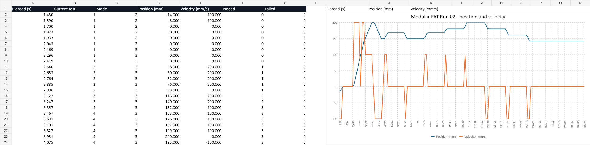
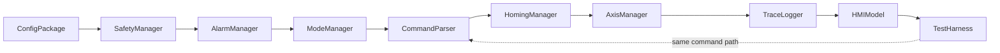

# Industrial Motion & Safety Bench

A software-first TwinCAT 3 portfolio project for virtual commissioning of an industrial linear axis. It combines modular IEC 61131-3 Structured Text, a deterministic motion plant, safety-oriented interlocks, alarms, homing, HMI design, trace logging, automated FAT and retained Scope evidence.

> Safety-oriented demonstration only. This repository makes no SIL/PL or certified machine-safety claim.

## Verified software baseline

- TwinCAT 3.1 build 4024.75 runtime operational on Windows 11.
- Generated modular PLC and complete runtime system compile with zero project errors.
- Modular application downloaded to ADS port 852 with a 10 ms task and autostart boot project.
- Modular FAT Run 02: **16 tests run, 16 passed, 0 failed**.
- Current source harness covers the expanded 16 software FAT scenarios.
- Runtime-restart check returned port 852 directly to ADS `Run`.
- Recovery Scope Run 01: **25,445 samples**, position **0–215 mm**, velocity **0–200 mm/s**.
- Dependency-free HMI prototype updated to the 16-scenario software FAT list.



## Architecture



The application supports OFF, INIT, HOMING, MANUAL, AUTO, FAULT and RESET. AxisManager selects either a deterministic software plant or a PLCopen path with linked `AXIS_REF` values.

## Repository

| Path | Contents |
|---|---|
| `plc/` | Reviewed ST source of truth |
| `twincat/RuntimeSimulation/` | Generated native TwinCAT DUT/GVL/POU project |
| `twincat/RuntimeSystem/` | Runnable local XAR/NC simulation system on ADS port 852 |
| `simulation/` | Virtual I/O/axis setup and retained evidence |
| `hmi/prototype/` | Animated browser HMI demonstration |
| `docs/` | URS, FDS, SDS, I/O, FAT/SAT, FMEA, commissioning checklist and final report |
| `hardware/` | Provisional BOM, risks and wiring plan |
| `portfolio/` | Case study and demonstration scripts |
| `tools/` | Generation, evidence and validation automation |

## Quick start

Open `twincat\MotionSafetyBenchRuntime.sln` when using TwinCAT XAE. Do not open
`MotionSafetyBenchPLC.plcproj` directly; it is a nested PLC project and requires
the parent TwinCAT system solution.

### Generate portable TwinCAT objects

```powershell
powershell -ExecutionPolicy Bypass -File .\tools\generate_twincat_project.ps1
```

Compile the complete runtime:

```powershell
# Close any interactive TwinCAT XAE Shell windows first.
powershell -ExecutionPolicy Bypass -File .\tools\build_twincat_solution.ps1 `
  -SolutionRelativePath 'twincat\MotionSafetyBenchRuntime.sln'
```

Deploy/activate the local hardware-free simulation target:

```powershell
powershell -ExecutionPolicy Bypass -File .\tools\deploy_twincat_runtime.ps1 `
  -Action Deploy
```

Run and capture the modular FAT:

```powershell
powershell -ExecutionPolicy Bypass -File .\tools\run_modular_fat.ps1
```

### Run the HMI prototype

```powershell
node .\tools\serve_hmi.mjs
```

Open `http://127.0.0.1:4173` and choose **Run 16-test simulation**.

### Rebuild evidence workbook

```powershell
node .\tools\build_simulation_evidence.mjs
```

Output: `outputs/motion-safety-bench/MotionSafetyBench_Simulation_Evidence.xlsx`.

## Evidence integrity

Run 01 proves the recovered TwinCAT runtime/ADS/Scope path. Run 02 is the accepted modular-application FAT and includes compile, download, 16/16 execution and boot-restart evidence. Hardware acceptance is governed by `docs/10_SAT_protocol.md`; simulation results are never substituted for hardware evidence.

## Phase 2

The preferred bench uses EK1100, EL1008, EL2008 and EL7211-0010 with a compatible 48 V servo. Procurement remains on hold until motor/load sizing and certified safety review are complete.
