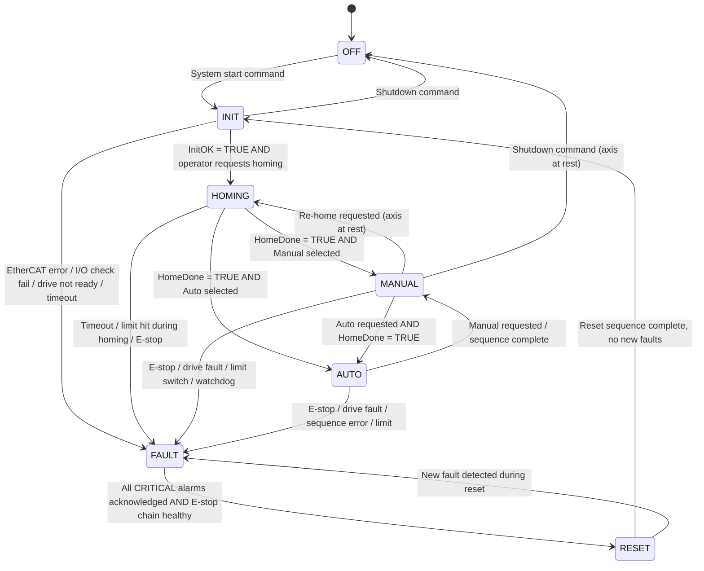

# Functional Design Specification (FDS)
## Industrial Motion and Safety Bench

**Document:** docs/02_FDS.md  
**Revision:** 1.0  
**Date:** 2026-06-20  
**Platform:** TwinCAT 3 / EtherCAT / IEC 61131-3 Structured Text  
**Status:** APPROVED — Baseline for ST software architecture  
**Safety note:** Safety-oriented design only. No certified SIL or PL function is claimed.  
**URS reference:** docs/01_URS.md Rev 1.0

---

## 1. Purpose

This FDS defines **how** the Industrial Motion and Safety Bench behaves to satisfy the URS. It provides the behavioral specification that directly governs the ST module architecture (Prompt 4), simulation design (Prompt 6), and the FAT test matrix (Prompt 8).

---

## 2. System State Machine

### 2.1 State Definitions

| State | Code | Description | Drive enabled | Beacon |
|-------|------|-------------|--------------|--------|
| OFF | 0 | System powered down or not started | No | Off |
| INIT | 1 | System initializing: EtherCAT check, I/O check, self-test | No | Blue |
| HOMING | 2 | Executing homing sequence on one or more axes | Yes (homing only) | Amber |
| MANUAL | 3 | Operator-controlled jog and individual moves | Yes | Green |
| AUTO | 4 | Executing automatic move sequence | Yes | Green flash |
| FAULT | 5 | Active fault — motion disabled, drive de-asserted | No | Red |
| RESET | 6 | Acknowledging and clearing fault, returning to INIT | No | Amber |

### 2.2 State Transition Diagram



### 2.3 State Transition Rules

| From | To | Condition | Guard / Precondition |
|------|----|-----------|---------------------|
| OFF | INIT | StartCommand received | Power healthy |
| INIT | HOMING | INIT sequence complete AND HomingRequest from operator | InitOK = TRUE, no CRITICAL alarms |
| INIT | FAULT | EtherCAT slaves not in OP within InitTimeout OR DI_DriveReady_Ax1 = FALSE after timeout | — |
| HOMING | MANUAL | MC_Home.Done = TRUE | HomeDone[1] = TRUE |
| HOMING | AUTO | MC_Home.Done = TRUE AND AutoModeRequest active | HomeDone[1] = TRUE |
| HOMING | FAULT | MC_Home.Error OR HomingTimeout OR limit hit OR E-stop during homing | — |
| MANUAL | AUTO | AutoModeRequest AND HomeDone[1] = TRUE | No CRITICAL alarms |
| MANUAL | HOMING | ReHomeRequest AND axis velocity = 0 | No CRITICAL alarms |
| MANUAL | FAULT | DI_EStop = FALSE OR DI_SafetyRelay_OK = FALSE OR drive fault OR watchdog | — |
| AUTO | MANUAL | ManualModeRequest (axis decelerates to stop first) | Axis Velocity → 0 before transition |
| AUTO | FAULT | DI_EStop = FALSE OR drive fault OR sequence error OR limit | — |
| FAULT | RESET | All CRITICAL alarms acknowledged AND DI_EStop = TRUE AND DI_SafetyRelay_OK = TRUE AND ResetRequest | All conditions true simultaneously |
| RESET | INIT | Reset sequence complete (2 s settle, drives cleared, I/O re-checked) | No new faults in settle period |
| RESET | FAULT | New fault detected during reset sequence | — |
| MANUAL | OFF | ShutdownRequest AND ActualVelocity[1] = 0 | Axis at rest |

---

## 3. Mode Behavior

### 3.1 OFF

System not running or shutdown commanded.

- All drive enables de-asserted: DO_DriveEnable_Ax1 = FALSE
- All brakes applied: DO_BrakeRelease_Ax1 = FALSE
- All output beacons off
- EtherCAT master in INIT/PREOP state
- HMI shows "OFFLINE" or connection banner

### 3.2 INIT

Entered at system start (from OFF) or after a completed RESET cycle. Maximum duration: InitTimeout (default 10 s).

**INIT sequence — executed in order:**

| Step | Action | Failure condition |
|------|--------|------------------|
| 1 | Set all digital outputs to safe state | — |
| 2 | Wait for EtherCAT bus to reach OP state on all configured slaves | Timeout → ALM-ETHERCAT-001 → FAULT |
| 3 | Check DI_EStop = TRUE (E-stop chain healthy) | If FALSE → ALM-ESTOP-001 → FAULT |
| 4 | Check DI_SafetyRelay_OK = TRUE | If FALSE → ALM-SAFETY-001 → FAULT |
| 5 | Check DI_DriveReady_Ax1 = TRUE (or simulation flag) | If FALSE after 3 s → ALM-DRIVE-001 → FAULT |
| 6 | Clear all non-latching alarms | — |
| 7 | Set InitOK = TRUE, Mode = INIT_COMPLETE | — |
| 8 | Wait for operator HomingRequest | — |

If any step fails within InitTimeout → ALM-INIT-001 → FAULT.

In simulation: DI_EStop and DI_SafetyRelay_OK default TRUE in stVirtualIO. Steps 2–5 pass immediately.

### 3.3 HOMING

Entered from INIT on operator request. Drive is powered and homing move executed.

**Homing sequence — Axis 1 (repeated for Axis 2 if present):**

```
Step 1:  Assert DO_DriveEnable_Ax1 = TRUE
Step 2:  Call MC_Power(Enable := TRUE, DriveAddress := Axis_1)
         Wait MC_Power.Status = TRUE (timeout 3 s → FAULT)
Step 3:  Assert DO_BrakeRelease_Ax1 = TRUE (if brake fitted)
Step 4:  Call MC_Home(Axis := Axis_1, Execute := TRUE,
                      HomingMode := eAbsSwitch,
                      Velocity := ConfigPackage.HomingVelocity,
                      Acceleration := ConfigPackage.HomingAcceleration,
                      Direction := ConfigPackage.HomingDirection,
                      HomePosition := ConfigPackage.HomeOffset)
Step 5:  Monitor MC_Home.Busy = TRUE (motion in progress)
Step 6:  Wait for DI_HomeSwitch_Ax1 rising edge (home switch found)
         OR MC_Home.Done (if HomingMode handles it internally)
Step 7:  MC_Home decelerates to zero, indexes to HomeOffset
Step 8:  MC_Home.Done = TRUE → set HomeDone[1] = TRUE
Step 9:  Log trace event: HOMING_COMPLETE, Axis=1, Position=HomeOffset
Step 10: Transition available: wait for ManualRequest or AutoRequest
```

**Homing fault conditions:**

| Condition | Alarm | Action |
|-----------|-------|--------|
| MC_Home.Error = TRUE | ALM-HOMING-001 | Immediate FAULT |
| HomingTimeout expired (default 30 s) | ALM-HOMING-001 | FAULT |
| DI_LimitPos_Ax1 or DI_LimitNeg_Ax1 activates | ALM-LIMIT-001/002 | MC_Stop → FAULT |
| DI_EStop = FALSE during homing | ALM-ESTOP-001 | MC_Stop → FAULT |

### 3.4 MANUAL

Operator controls individual axis motion. Drive remains enabled.

**Available operator commands:**

| Command | Function block | Behaviour |
|---------|---------------|-----------|
| Jog positive | MC_Jog(Forward := TRUE) | Moves while button held. Stops on release: MC_Jog(Forward := FALSE) |
| Jog negative | MC_Jog(Backward := TRUE) | Same logic, opposite direction |
| Absolute move | MC_MoveAbsolute | Moves to TargetPosition at MoveVelocity. See Section 5.1 |
| Relative move | MC_MoveRelative | Moves RelDistance from current position. See Section 5.2 |
| Stop | MC_Halt | Decelerates to stop at MoveDeceleration. Position hold after. |
| Re-home | ModeManager → HOMING | Axis must be at rest. Starts new homing cycle. |

**Soft limit enforcement in MANUAL:**
Before executing any move command, CommandParser calculates the resulting axis position and compares to SoftLimitPos and SoftLimitNeg. If outside limits: command rejected, ALM-SOFTLIMIT-001 raised, no motion.

During jog: actual position monitored every scan. If position reaches SoftLimit − decelerationBuffer: MC_Halt triggered automatically.

### 3.5 AUTO

Executes a defined automatic move cycle. Cycle runs until MaxCycles reached or operator requests MANUAL.

**Default AUTO sequence (configurable positions in ConfigPackage):**

```
Step 1 — Move to Position A:
   MC_MoveAbsolute(Position := PositionA, Velocity := MoveVelocity,
                   Acceleration := MoveAcceleration, Deceleration := MoveDeceleration)
   Wait MC_MoveAbsolute.Done

Step 2 — Dwell at A:
   Wait DwellTime_A (ms, configurable, default 500)

Step 3 — Move to Position B:
   MC_MoveAbsolute(Position := PositionB, ...)
   Wait MC_MoveAbsolute.Done

Step 4 — Dwell at B:
   Wait DwellTime_B (ms, configurable, default 500)

Step 5 — Return to Position A:
   MC_MoveAbsolute(Position := PositionA, ...)
   Wait MC_MoveAbsolute.Done

Step 6 — Increment CycleCount

Step 7 — Decision:
   IF CycleCount < MaxCycles THEN → Step 1
   ELSE → SequenceComplete = TRUE, hold at PositionA, remain in AUTO
```

**AUTO interruption:**
- Operator presses Manual → current move decelerates to stop (MC_Halt) → transition to MANUAL. HomeDone retained.
- Fault detected → MC_Stop (emergency decel) → FAULT.

**CycleCount:** increments per complete A→B→A cycle. Reset by operator on Auto screen.

### 3.6 FAULT

All motion disabled. System latched in FAULT until complete operator reset.

**On FAULT entry (from any mode):**

| Action | Detail |
|--------|--------|
| MC_Stop all axes | Deceleration = EmergencyDeceleration (default 1000 mm/s²) |
| MC_Power disable | After MC_Stop.Done or after 500 ms timeout |
| DO_DriveEnable_Ax1 = FALSE | Within 1 PLC scan of FAULT entry |
| DO_BrakeRelease_Ax1 = FALSE | Applied at same time as drive disable |
| DO_Beacon_Red = TRUE | Fault indicator on |
| DO_Beacon_Green = FALSE | Run indicator off |
| AlarmManager: log FAULT event | Timestamp, mode before FAULT, active alarm IDs |
| HomeDone: retained | Not cleared — re-homing not required if position data valid |

**FAULT exit conditions (all must be true simultaneously):**
1. All CRITICAL alarms acknowledged by operator
2. DI_EStop = TRUE (E-stop button released)
3. DI_SafetyRelay_OK = TRUE
4. Operator presses Reset button

If any condition false when Reset pressed → Reset button has no effect, ALM-MODE-001 raised.

### 3.7 RESET

Transitional state. Validates system readiness before returning to INIT.

**RESET sequence:**

| Step | Action | Duration |
|------|--------|---------|
| 1 | Verify all CRITICAL alarms acknowledged | Instant check |
| 2 | Verify DI_EStop = TRUE | Instant check |
| 3 | Verify DI_SafetyRelay_OK = TRUE | Instant check |
| 4 | 2-second settle period | 2000 ms |
| 5 | Re-check all I/O status | Instant |
| 6 | Clear all non-latching alarm flags | Instant |
| 7 | De-assert all outputs (safe state) | Instant |
| 8 | MC_Reset on all axes (clear drive fault) | Wait MC_Reset.Done |
| 9 | Set Mode = INIT | Transition complete |

If new fault detected at any step → return to FAULT immediately.

HomeDone flags: retained through RESET if no position data loss (encoder battery backup, or virtual axis). Cleared if drive fault involved possible position loss → re-homing required.

---

## 4. Homing Procedure (Detailed)

### 4.1 Homing Parameters

All parameters stored in ConfigPackage and editable on Configuration HMI screen.

| Parameter | Default | Unit | Description |
|-----------|---------|------|-------------|
| HomingVelocity | 10.0 | mm/s | Speed for home switch search move |
| HomingDirection | Negative | — | Direction to search: Negative = toward axis origin |
| HomingAcceleration | 100.0 | mm/s² | Acceleration for homing move |
| HomeOffset | 0.0 | mm | Position value assigned at home switch |
| HomingTimeout | 30.0 | s | Maximum allowed time for homing |
| HomingRetractDistance | 2.0 | mm | Retract distance before index if applicable |

### 4.2 Homing Logic Flow

```
ENTER HOMING
    │
    ├─ MC_Power.Enable = TRUE → wait Status = TRUE
    │       timeout 3s → ALM-DRIVE-001 → FAULT
    │
    ├─ DO_BrakeRelease = TRUE
    │
    ├─ MC_Home.Execute = TRUE
    │       │
    │       ├─ Moving at HomingVelocity in HomingDirection
    │       │       │
    │       │       ├─ DI_HomeSwitch rising edge detected?
    │       │       │   YES → decelerate → position := HomeOffset
    │       │       │         MC_Home.Done = TRUE
    │       │       │         HomeDone[1] = TRUE
    │       │       │         Log HOMING_COMPLETE → ──────► MANUAL or AUTO
    │       │       │
    │       │       ├─ DI_LimitPos or DI_LimitNeg activated?
    │       │       │   YES → MC_Stop → ALM-LIMIT-001 → FAULT
    │       │       │
    │       │       └─ HomingTimeout elapsed?
    │       │           YES → MC_Home abort → ALM-HOMING-001 → FAULT
    │       │
    │       └─ MC_Home.Error = TRUE?
    │               YES → ALM-HOMING-001 → FAULT
```

---

## 5. Motion Behavior

### 5.1 Absolute Move Execution

```
OPERATOR inputs TargetPosition via HMI
CommandParser checks:
    IF TargetPosition > SoftLimitPos OR TargetPosition < SoftLimitNeg THEN
        RAISE ALM-SOFTLIMIT-001
        REJECT command — no motion
    ELSE
        MC_MoveAbsolute(
            Axis        := Axis_1,
            Execute     := TRUE,
            Position    := TargetPosition,
            Velocity    := MoveVelocity,
            Acceleration:= MoveAcceleration,
            Deceleration:= MoveDeceleration,
            BufferMode  := mcAborting
        )
        Monitor MC_MoveAbsolute.Busy, .Done, .Error
        On .Done → position hold (MC_Power still enabled)
        On .Error → ALM-DRIVE-001 → FAULT
        Log MOVE_COMPLETE event to TraceLogger
```

### 5.2 Relative Move Execution

Same as 5.1 except:
- TargetPosition = ActualPosition + RelDistance (calculated in CommandParser)
- Check calculated TargetPosition against soft limits
- MC_MoveRelative(Distance := RelDistance, ...)

### 5.3 Jog Execution

```
JogPositive button held:
    MC_Jog(Axis := Axis_1, Forward := TRUE, Velocity := JogVelocity)
    Every scan: IF ActualPosition[1] >= (SoftLimitPos - JogDecelerationBuffer)
                THEN MC_Halt → hold at limit
    Button released:
    MC_Jog(Forward := FALSE) → decelerate to stop → position hold

JogNegative: symmetric in negative direction.

JogDecelerationBuffer = (JogVelocity²) / (2 × MoveDeceleration)
    (calculated from kinematic deceleration distance)
```

### 5.4 Motion Parameters (ConfigPackage defaults)

| Parameter | Default | Unit |
|-----------|---------|------|
| MoveVelocity | 50.0 | mm/s |
| MoveAcceleration | 200.0 | mm/s² |
| MoveDeceleration | 200.0 | mm/s² |
| JogVelocity | 20.0 | mm/s |
| EmergencyDeceleration | 1000.0 | mm/s² |
| SoftLimitPositive | +200.0 | mm |
| SoftLimitNegative | −10.0 | mm |
| PositionA (AUTO) | 50.0 | mm |
| PositionB (AUTO) | 150.0 | mm |
| DwellTime_A | 500 | ms |
| DwellTime_B | 500 | ms |
| MaxCycles | 10 | cycles |

---

## 6. Safe Stop / Hold Concept

**Safety-oriented design — not certified SIL/PL.**

| Trigger | Response | Result |
|---------|---------|--------|
| DI_EStop = FALSE | MC_Stop (EmergencyDecel) → MC_Power disable | Drive disabled, brake applied, FAULT |
| DI_SafetyRelay_OK = FALSE | Same as E-stop | Drive disabled, brake applied, FAULT |
| DI_LimitPos or DI_LimitNeg activated | MC_Stop (EmergencyDecel) → disable | Drive disabled, FAULT |
| Soft limit approached during jog | MC_Halt (MoveDecel) | Drive enabled, position hold |
| FAULT entry from AUTO/MANUAL | MC_Stop (EmergencyDecel) → disable | Drive disabled, FAULT |
| Normal AUTO stop | MC_Halt (MoveDecel) | Drive enabled, position hold |
| Controlled shutdown (MANUAL→OFF) | MC_Halt → MC_Power disable | Drive disabled, brake applied |

**Drive enable interlock logic (SafetyManager, evaluated every PLC scan):**

```
bSafetyOK := DI_EStop AND DI_SafetyRelay_OK AND NOT bDriveFault_Ax1;

DO_DriveEnable_Ax1 := bSafetyOK
                   AND (eCurrentMode = HOMING
                     OR eCurrentMode = MANUAL
                     OR eCurrentMode = AUTO);

DO_BrakeRelease_Ax1 := DO_DriveEnable_Ax1
                    AND bMotionCommandActive_Ax1;
```

This logic is evaluated unconditionally every scan. SafetyManager has the highest priority in the PLC task execution order.

---

## 7. Alarm Philosophy

### 7.1 Severity Levels and Behavior

| Severity | Motion effect | Acknowledgement | Reset rule |
|---------|--------------|----------------|-----------|
| CRITICAL | Triggers FAULT mode, disables all motion | Operator must acknowledge each alarm | Manual reset via RESET cycle after acknowledge |
| WARNING | Displayed, motion may continue | Auto-clear when condition clears | Auto-clear |
| INFO | Logged, displayed | None required | Auto-clear after InfoTimeout (default 10 s) |

### 7.2 Alarm List

| Alarm ID | Description | Severity | Trigger condition | Operator action |
|----------|------------|---------|------------------|----------------|
| ALM-ESTOP-001 | E-stop activated | CRITICAL | DI_EStop = FALSE | Clear E-stop, acknowledge, Reset |
| ALM-SAFETY-001 | Safety relay fault | CRITICAL | DI_SafetyRelay_OK = FALSE | Inspect relay wiring, acknowledge, Reset |
| ALM-LIMIT-001 | Positive limit hit Ax1 | CRITICAL | DI_LimitPos_Ax1 active during motion | Jog clear in MANUAL after Reset |
| ALM-LIMIT-002 | Negative limit hit Ax1 | CRITICAL | DI_LimitNeg_Ax1 active during motion | Jog clear in MANUAL after Reset |
| ALM-HOMING-001 | Homing failed Ax1 | CRITICAL | Timeout OR MC_Home.Error | Check home switch, re-home |
| ALM-DRIVE-001 | Drive fault Ax1 | CRITICAL | Drive error status OR DI_DriveReady_Ax1=FALSE | Check drive, clear fault at drive, Reset |
| ALM-ETHERCAT-001 | EtherCAT link lost | CRITICAL | Slave not in OP state | Check cable/device, restart |
| ALM-WATCHDOG-001 | PLC scan overrun | CRITICAL | Cycle time > WatchdogTolerance | Reduce PLC load, Reset |
| ALM-INIT-001 | Init sequence timeout | CRITICAL | InitTimeout expired in INIT | Check I/O, EtherCAT, restart |
| ALM-SOFTLIMIT-001 | Soft limit exceeded | WARNING | Commanded pos outside [SoftLimitNeg, SoftLimitPos] | Correct target position |
| ALM-HOMING-002 | Axis not homed | WARNING | AUTO requested, HomeDone=FALSE | Complete homing first |
| ALM-MODE-001 | Invalid transition | WARNING | Mode change attempted without preconditions | Follow correct mode sequence |

### 7.3 Alarm Processing Cycle (every PLC scan)

```
AlarmManager:
    FOR each alarm condition:
        Evaluate trigger condition
        IF newly active AND not already in active list:
            Add to ActiveAlarms[], timestamp = GetSystemTime()
            IF severity = CRITICAL: set FaultRequest = TRUE → ModeManager
            Increment ActiveCount
            Add entry to AlarmHistory[]
        IF condition cleared AND alarm is non-latching (WARNING/INFO):
            Remove from ActiveAlarms[]
            Decrement ActiveCount
            Update AlarmHistory[] entry (cleared timestamp)
    HMI.AlarmCount := ActiveCount
    HMI.ActiveAlarmList := ActiveAlarms[]
```

CRITICAL alarms are latched. They remain in ActiveAlarms[] until:
1. Condition is physically cleared (e.g., E-stop released)
2. Operator presses Acknowledge on HMI Alarms screen
3. System enters RESET mode

---

## 8. HMI Screen Descriptions

### 8.1 Screen 1 — Overview

| Element | Source tag | Position |
|---------|-----------|---------|
| Mode badge (colour-coded) | ModeManager.eCurrentMode | Top center, full-width |
| E-stop status (OK / FAULT) | SafetyManager.bEStopOK | Top right |
| Alarm count badge | AlarmManager.nActiveCount | Top left, red if >0 |
| Axis 1 actual position | AxisManager.rActualPosition[1] | Center — large font |
| Axis 1 actual velocity | AxisManager.rActualVelocity[1] | Below position |
| PLC cycle time | System.CycleTime | Bottom right, small |
| Mode select buttons | ModeManager.eModeRequest | Bottom bar |
| Screen navigation | — | Left sidebar |

### 8.2 Screen 2 — Axis Status

One panel per axis. Per-axis data: actual position, commanded position, position error, actual velocity, commanded velocity, drive enable state, brake state, limit switch states (pos, neg), home switch state, HomeDone flag, drive status word (hex), MC_ function block active state.

### 8.3 Screen 3 — Manual / Jog

Left panel — controls:
- Jog+ (hold button) / Jog− (hold button)
- Target position input + Move Absolute button
- Relative distance input + Move Relative button  
- Stop button (MC_Halt)
- Velocity setpoint (mm/s)

Right panel — display:
- Current position (large)
- Last alarm description
- Motion status (Busy / Done / Error)

### 8.4 Screen 4 — Auto Sequence

Top: Sequence state machine visualization (step boxes, current step highlighted)  
Middle: CycleCount / MaxCycles progress bar  
Bottom controls: Start, Stop/Pause, Reset count  
Parameters (read-only, editable in Configuration): PositionA, PositionB, DwellTime_A, DwellTime_B

### 8.5 Screen 5 — Alarms

Upper half — Active alarms table:

| Column | Content |
|--------|---------|
| Severity | CRITICAL / WARNING / INFO colour badge |
| Alarm ID | e.g. ALM-ESTOP-001 |
| Description | Short text |
| Timestamp | yyyy-mm-dd hh:mm:ss.mmm |
| Acknowledge | Checkbox button |

Lower half — Alarm history (last 100 entries, scrollable):  
Same columns plus Cleared timestamp and Acknowledged status.

Controls: Acknowledge Selected, Acknowledge All, Clear Acknowledged from history.

### 8.6 Screen 6 — Diagnostics / Trace

Table showing last 50 trace entries:

| Column | Content |
|--------|---------|
| Timestamp | PLC system time ms |
| Mode | Mode name |
| Ax1 Pos | mm, 3 decimal places |
| Ax1 Vel | mm/s, 1 decimal |
| Alarms | Active count |
| IO State | Packed WORD (hex) |
| Event | Event label if mode transition |

Controls: Export CSV button (writes trace buffer to file), Refresh Rate selector (50/100/200 ms), Clear buffer button.

### 8.7 Screen 7 — Configuration (Access-controlled)

Grouped parameters with input fields and current/default values displayed:

**Motion:** MoveVelocity, MoveAcceleration, MoveDeceleration, JogVelocity, EmergencyDeceleration  
**Limits:** SoftLimitPos, SoftLimitNeg  
**Homing:** HomingVelocity, HomingDirection, HomeOffset, HomingTimeout  
**Auto sequence:** PositionA, PositionB, DwellTime_A, DwellTime_B, MaxCycles  
**System:** WatchdogTolerance, InfoTimeout, bSimulationMode  

Save button → writes to persistent ConfigPackage storage. Reset to defaults button available.

---

## 9. I/O Signal List

### 9.1 Digital Inputs

| Tag name | Description | Type | NC/NO | Simulation default | Phase 2 terminal |
|---------|------------|------|-------|------------------|-----------------|
| DI_EStop | E-stop chain input (NC — de-asserts on E-stop press) | BOOL | NC | TRUE | EL1008.Ch1 |
| DI_SafetyRelay_OK | Safety relay output feedback | BOOL | NO | TRUE | EL1008.Ch2 |
| DI_LimitPos_Ax1 | Positive hardware limit switch Axis 1 | BOOL | NC | FALSE | EL1008.Ch3 |
| DI_LimitNeg_Ax1 | Negative hardware limit switch Axis 1 | BOOL | NC | FALSE | EL1008.Ch4 |
| DI_HomeSwitch_Ax1 | Home switch Axis 1 (NO — asserts at home position) | BOOL | NO | FALSE | EL1008.Ch5 |
| DI_SensorA | Inductive proximity sensor A | BOOL | NO | FALSE | EL1008.Ch6 |
| DI_SensorB | Inductive proximity sensor B | BOOL | NO | FALSE | EL1008.Ch7 |
| DI_DriveReady_Ax1 | Drive ready feedback from EL7211 | BOOL | NO | TRUE | EL7211 status |

### 9.2 Digital Outputs

| Tag name | Description | Safe state | Phase 2 terminal |
|---------|------------|-----------|-----------------|
| DO_DriveEnable_Ax1 | Drive enable Axis 1 | FALSE | EL2008.Ch1 |
| DO_BrakeRelease_Ax1 | Motor brake release Axis 1 (energise to release) | FALSE | EL2008.Ch2 |
| DO_Beacon_Green | Status beacon green — system running | FALSE | EL2008.Ch3 |
| DO_Beacon_Amber | Status beacon amber — homing / warning | FALSE | EL2008.Ch4 |
| DO_Beacon_Red | Status beacon red — FAULT | FALSE | EL2008.Ch5 |

### 9.3 Beacon Output Logic

| Mode | Green | Amber | Red |
|------|-------|-------|-----|
| OFF | OFF | OFF | OFF |
| INIT | OFF | Flash 1Hz | OFF |
| HOMING | OFF | ON steady | OFF |
| MANUAL | ON steady | OFF | OFF |
| AUTO | Flash 2Hz | OFF | OFF |
| FAULT | OFF | OFF | ON steady |
| RESET | OFF | Flash 2Hz | OFF |

### 9.4 Axis References

| Tag name | Description | Phase 2 drive |
|---------|------------|--------------|
| Axis_1 | Primary servo axis (AXIS_REF) | EL7211-0010 Ch1 → AM31xx or AM81xx |
| Axis_2 | Optional second servo axis (AXIS_REF) | EL7211-0010 Ch2 → AM31xx or AM81xx |

### 9.5 Virtual I/O Structure (Simulation)

When `ConfigPackage.bSimulationMode = TRUE`, physical DI/DO mapped to `stVirtualIO`:

```pascal
TYPE stVirtualIO :
STRUCT
    (* Simulated inputs — operator manipulates these during simulation FAT *)
    DI_EStop            : BOOL := TRUE;   (* TRUE = chain healthy *)
    DI_SafetyRelay_OK   : BOOL := TRUE;
    DI_LimitPos_Ax1     : BOOL := FALSE;
    DI_LimitNeg_Ax1     : BOOL := FALSE;
    DI_HomeSwitch_Ax1   : BOOL := FALSE;
    DI_SensorA          : BOOL := FALSE;
    DI_SensorB          : BOOL := FALSE;
    DI_DriveReady_Ax1   : BOOL := TRUE;
    (* Mirrored outputs — visible in simulation for verification *)
    DO_DriveEnable_Ax1  : BOOL;
    DO_BrakeRelease_Ax1 : BOOL;
    DO_Beacon_Green     : BOOL;
    DO_Beacon_Amber     : BOOL;
    DO_Beacon_Red       : BOOL;
END_STRUCT
END_TYPE
```

**Zero ST logic changes** are required when switching `bSimulationMode` between TRUE and FALSE.

---

## 10. Network and Device Configuration

### 10.1 Simulation Configuration

| Element | Value |
|---------|-------|
| EtherCAT master | TwinCAT 3 NC PTP, dev PC |
| Axes | TwinCAT virtual axes (no physical device) |
| Cycle time | 1 ms |
| HMI | TwinCAT HMI (in-process or standalone) |
| I/O | stVirtualIO structure |

### 10.2 Phase 2 EtherCAT Device Tree

```
EtherCAT Master: TwinCAT 3 (Windows PC — dedicated NIC or USB adapter)
  │
  └── EK1100 EtherCAT Coupler
        ├── [1002] EL7211-0010  Servo Terminal, Axis 1 (48V DC, 4.5A, OCT)
        ├── [1003] EL7211-0010  Servo Terminal, Axis 2 (optional)
        ├── [1004] EL1008       Digital Input Terminal, 8-ch, 24V DC
        ├── [1005] EL2008       Digital Output Terminal, 8-ch, 24V DC, 0.5A
        └── [1006] EL9011       Bus End Terminal
```

EtherCAT cycle: 1 ms. Distributed clocks enabled (DC mode) for synchronised servo control.

---

## 11. Document Control

| Rev | Date | Author | Change |
|-----|------|--------|--------|
| 1.0 | 2026-06-20 | Project team | Initial issue |

---
*This FDS governs: ST architecture (docs/03_SDS.md + Prompt 4), simulation design (Prompt 6), HMI tag map (hmi/hmi_tag_map.md), and FAT protocol (docs/09_FAT_protocol.md).*
