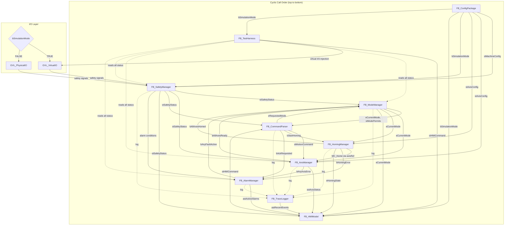

# 03 — Software Design Specification (SDS)

**Project:** Industrial Motion & Safety Bench  
**Document:** SDS Rev 1.0  
**Date:** 2026-06-21  
**Phase:** 4 — ST Software Architecture  
**Platform:** TwinCAT 3 XAE, IEC 61131-3 Structured Text  
**Prerequisite:** URS Rev 1.0 and FDS Rev 1.0 approved  

---

## 1. Purpose

This document defines the internal software architecture for the Industrial Motion & Safety Bench. It specifies every module's responsibility, interfaces, internal states, error handling, inter-module interactions, and simulation hooks. It also defines all shared data types, naming conventions, the cyclic call order, and the exact Claude Code prompt for generating the first ST code skeleton.

No code is produced in this document. Code generation follows only after architecture review and approval.

---

## 2. Design Principles

| Principle | Rule |
|---|---|
| Modularity | One function block per concern. No monolithic MAIN logic. |
| Determinism | Fixed cyclic call order. No asynchronous side effects between modules. |
| Simulation parity | Every module behaves identically in simulation and hardware mode. Only the I/O layer switches via `bSimulationMode`. |
| Safety-oriented | SafetyManager is always evaluated before motion. Safety overrides all motion commands. Not certified SIL/PL. |
| Testability | Every module exposes status that TestHarness can read. Every command path is exercisable from TestHarness. |
| Traceability | Every state transition, alarm, command, and fault is logged via TraceLogger. |
| No hardcoded addresses | All I/O is symbolic. Physical addresses are assigned only during hardware integration. |

---

## 3. Cyclic Call Order (MAIN Program)

The MAIN program calls modules in this exact order every scan cycle. The order is not arbitrary — it ensures safety is evaluated before motion, alarms are current before mode decisions, and HMI data reflects the completed cycle.

| Step | Module | Rationale |
|---|---|---|
| 1 | `fbConfig.Cyclic()` | Load/validate configuration parameters first. |
| 2 | `fbSafety.Cyclic()` | Read and evaluate all safety inputs before any motion decision. |
| 3 | `fbAlarm.EvaluateConditions()` | Check alarm conditions from safety, axes, and sensors. |
| 4 | `fbMode.Cyclic()` | Determine operating mode based on safety status, alarm status, and operator requests. |
| 5 | `fbCommand.Cyclic()` | Parse and validate queued operator/HMI commands against current mode. |
| 6 | `fbHoming.Cyclic()` | Execute homing sequence if mode is HOMING. |
| 7 | `fbAxis.Cyclic()` | Execute motion commands. Respects mode permits and safety holds. |
| 8 | `fbAlarm.UpdateOutputs()` | Finalize alarm states after motion evaluation. |
| 9 | `fbTrace.Cyclic()` | Flush pending trace events to ring buffer. |
| 10 | `fbHMI.Cyclic()` | Aggregate all module statuses into HMI tag structure. |
| 11 | `fbTest.Cyclic()` | Run test sequences if simulation test mode is active. |

---

## 4. Module Specifications

### 4.1 ModeManager (`FB_ModeManager`)

**File:** `ModeManager.st`

**Responsibility:** Central finite state machine governing the system operating mode. All other modules query ModeManager to know what operations are permitted. ModeManager does not perform motion or I/O — it only decides which mode is active and whether transitions are valid.

**Inputs:**

| Name | Type | Source | Description |
|---|---|---|---|
| `stSafetyStatus` | `ST_SafetyStatus` | SafetyManager | Current safety state |
| `bAnyFaultActive` | `BOOL` | AlarmManager | TRUE if any FAULT-severity alarm is active |
| `bAllAxesReady` | `BOOL` | AxisManager | TRUE if all axes are powered and error-free |
| `bAllAxesHomed` | `BOOL` | HomingManager | TRUE if all axes have completed homing |
| `eRequestedMode` | `E_MachineMode` | CommandParser | Operator-requested mode |
| `bResetRequested` | `BOOL` | CommandParser | Operator reset command |

**Outputs:**

| Name | Type | Consumer | Description |
|---|---|---|---|
| `eCurrentMode` | `E_MachineMode` | All modules | Active operating mode |
| `ePreviousMode` | `E_MachineMode` | TraceLogger | Mode before last transition |
| `bModeTransitionActive` | `BOOL` | HMIModel | TRUE during transition |
| `stModePermits` | `ST_ModePermits` | AxisManager, CommandParser | What operations are allowed in current mode |

**Internal States:**

| Name | Type | Description |
|---|---|---|
| `eInternalMode` | `E_MachineMode` | Working copy of current mode |
| `tonInitTimeout` | `TON` | Timeout watchdog for INIT mode |
| `tonHomingTimeout` | `TON` | Timeout watchdog for HOMING mode |
| `bTransitionValid` | `BOOL` | Result of last transition validation |

**State Transition Rules:**

| From | To | Condition |
|---|---|---|
| OFF | INIT | Operator requests INIT AND bSafeToRun |
| INIT | HOMING | Init sequence complete (axes powered, config loaded) AND no faults |
| INIT | FAULT | Init timeout OR axis power failure |
| HOMING | MANUAL_JOG | All axes homed successfully |
| HOMING | FAULT | Homing timeout OR homing error |
| MANUAL_JOG | AUTO | Operator requests AUTO AND all axes homed AND no faults |
| MANUAL_JOG | HOMING | Operator requests re-home |
| AUTO | MANUAL_JOG | Operator requests MANUAL_JOG (auto sequence stops) |
| AUTO | FAULT | Runtime fault during auto sequence |
| ANY | FAULT | E-stop active OR critical alarm OR safety violation |
| FAULT | RESET | Operator requests reset AND E-stop inactive |
| RESET | INIT | All faults cleared AND all alarms acknowledged |
| RESET | FAULT | Reset failed (faults not clearable) |

**Error Handling:**
- Invalid mode transition requests are rejected silently and logged via TraceLogger.
- INIT timeout (configurable, default 10 s) forces transition to FAULT.
- HOMING timeout (configurable, default 60 s) forces transition to FAULT.
- Loss of `bSafeToRun` during any mode except OFF/FAULT forces immediate transition to FAULT.

**Interaction with Other Modules:**
- Reads: SafetyManager, AlarmManager, AxisManager, HomingManager, CommandParser.
- Writes to: No other module directly. Exposes `eCurrentMode` and `stModePermits` that other modules read.
- Logs: Every transition via TraceLogger.

**Simulation Hooks:**
- No simulation-specific behavior. Mode logic is identical in simulation and hardware. The difference is only in the I/O signals feeding SafetyManager and AxisManager.

---

### 4.2 AxisManager (`FB_AxisManager`)

**File:** `AxisManager.st`

**Responsibility:** Wraps all PLCopen motion function blocks for each axis. Accepts high-level motion commands (power, move, stop, reset) and translates them into PLCopen FB calls against AXIS_REF instances. Enforces mode permits before executing any motion.

**Inputs:**

| Name | Type | Source | Description |
|---|---|---|---|
| `stModePermits` | `ST_ModePermits` | ModeManager | Permitted operations in current mode |
| `eCurrentMode` | `E_MachineMode` | ModeManager | Current operating mode |
| `stCommand` | `ST_MotionCommand` | CommandParser | Motion command to execute |
| `stSafetyStatus` | `ST_SafetyStatus` | SafetyManager | Safety override |
| `stAxisConfig` | `ARRAY[1..GVL_Constants.MAX_AXES] OF ST_AxisConfig` | ConfigPackage | Per-axis parameters |

**Outputs:**

| Name | Type | Consumer | Description |
|---|---|---|---|
| `astAxisStatus` | `ARRAY[1..GVL_Constants.MAX_AXES] OF ST_AxisStatus` | HMIModel, ModeManager, TestHarness | Per-axis status |
| `bAllAxesReady` | `BOOL` | ModeManager | All axes powered and no errors |
| `bAnyAxisError` | `BOOL` | AlarmManager | Any axis in error state |
| `bMotionComplete` | `BOOL` | CommandParser, TestHarness | Current motion command finished |

**Internal States per Axis:**

| Name | Type | Description |
|---|---|---|
| `fbMcPower` | `MC_Power` | PLCopen power control |
| `fbMcHome` | `MC_Home` | PLCopen homing (delegated to HomingManager) |
| `fbMcMoveAbsolute` | `MC_MoveAbsolute` | Absolute positioning |
| `fbMcMoveRelative` | `MC_MoveRelative` | Relative positioning |
| `fbMcStop` | `MC_Stop` | Controlled stop |
| `fbMcReset` | `MC_Reset` | Error reset |
| `fbMcJog` | `MC_Jog` | Manual jog motion |
| `axisRef` | `AXIS_REF` | Axis reference (virtual or physical) |
| `eAxisState` | `E_AxisState` | PLCopen axis state mirror |

**Public Methods:**

| Method | Parameters | Description |
|---|---|---|
| `PowerAxis` | `nAxisIndex: UINT, bEnable: BOOL` | Enable/disable axis power |
| `MoveAbsolute` | `nAxisIndex: UINT, fPosition: LREAL, fVelocity: LREAL` | Start absolute move |
| `MoveRelative` | `nAxisIndex: UINT, fDistance: LREAL, fVelocity: LREAL` | Start relative move |
| `JogAxis` | `nAxisIndex: UINT, bPositive: BOOL, bNegative: BOOL` | Manual jog |
| `StopAxis` | `nAxisIndex: UINT` | Controlled stop |
| `StopAllAxes` | — | Stop all axes immediately |
| `ResetAxis` | `nAxisIndex: UINT` | Reset axis error |

**Error Handling:**
- Any PLCopen FB error sets `bAnyAxisError` and populates the axis status error code.
- Safety override (`NOT bSafeToRun`) triggers `StopAllAxes` unconditionally.
- Commands received while mode permits deny motion are rejected and logged.
- Position following error beyond `stAxisConfig.fPositionErrorLimit` raises alarm.

**Interaction with Other Modules:**
- Reads: ModeManager (permits), CommandParser (commands), SafetyManager (override), ConfigPackage (parameters).
- Writes to: Exposes `astAxisStatus` read by HMIModel, AlarmManager, ModeManager, TestHarness.
- HomingManager directly accesses `axisRef` and PLCopen homing FBs during HOMING mode.

**Simulation Hooks:**
- `AXIS_REF` points to TwinCAT virtual axis in simulation, physical axis in hardware.
- No code change required. The switch happens in the TwinCAT device tree via `bSimulationMode` configuration.

---

### 4.3 HomingManager (`FB_HomingManager`)

**File:** `HomingManager.st`

**Responsibility:** Executes the homing sequence for each axis when the system is in HOMING mode. Manages the multi-step homing procedure: seek limit switch, back off, find index, set reference position.

**Inputs:**

| Name | Type | Source | Description |
|---|---|---|---|
| `eCurrentMode` | `E_MachineMode` | ModeManager | Must be HOMING for execution |
| `bStartHoming` | `BOOL` | CommandParser | Rising edge starts homing |
| `bAbortHoming` | `BOOL` | CommandParser / SafetyManager | Abort homing immediately |
| `abHomeSwitchActive` | `ARRAY[1..MAX_AXES] OF BOOL` | I/O (virtual or physical) | Home switch sensor state |
| `stAxisConfig` | `ARRAY[1..MAX_AXES] OF ST_AxisConfig` | ConfigPackage | Homing velocity, direction, offsets |

**Outputs:**

| Name | Type | Consumer | Description |
|---|---|---|---|
| `abAxisHomed` | `ARRAY[1..MAX_AXES] OF BOOL` | ModeManager, HMIModel | Per-axis homed flag |
| `bAllAxesHomed` | `BOOL` | ModeManager | All axes homed |
| `bHomingActive` | `BOOL` | HMIModel | Homing in progress |
| `bHomingError` | `BOOL` | AlarmManager | Homing failed |
| `eHomingState` | `E_HomingState` | HMIModel, TraceLogger | Current homing step |

**Internal States per Axis:**

| Name | Type | Description |
|---|---|---|
| `eStep` | `E_HomingState` | Current homing step |
| `nRetryCount` | `UINT` | Retries attempted |
| `tonHomingStepTimeout` | `TON` | Per-step timeout |
| `fbMcHome` | `MC_Home` | PLCopen homing FB reference |

**Homing Sequence Steps:**
1. `IDLE` — Waiting for start command in HOMING mode.
2. `SEEKING_SWITCH` — Moving toward home switch at homing velocity.
3. `BACKING_OFF` — Reversing off the switch at reduced velocity.
4. `SEEKING_INDEX` — Slow approach to find switch edge or index pulse.
5. `SETTING_POSITION` — Setting the axis reference position to configured home offset.
6. `COMPLETE` — Homing done, axis position is referenced.
7. `ERROR` — Homing failed (timeout, sensor fault, axis error).

**Error Handling:**
- Per-step timeout (configurable, default 15 s per step) triggers homing error.
- Maximum retry count (configurable, default 2) before declaring homing failure.
- Home switch stuck-active at start triggers alarm (sensor may be faulty).
- Any axis error during homing aborts and reports.

**Interaction with Other Modules:**
- Reads: ModeManager (mode check), ConfigPackage (homing parameters), I/O signals.
- Writes to: Exposes homed flags to ModeManager. Uses AxisManager's `axisRef` for motion.
- Raises alarms via AlarmManager on homing failure.
- Logs every homing step transition via TraceLogger.

**Simulation Hooks:**
- In simulation, home switch signals come from `GVL_VirtualIO.abDigitalInputs` which the TestHarness or simulation environment can drive.
- Homing logic is identical. The virtual axis responds to MC_Home the same way.

---

### 4.4 SafetyManager (`FB_SafetyManager`)

**File:** `SafetyManager.st`

**Responsibility:** Aggregates all safety-related inputs (E-stop, safety relay feedback, limit switches, drive-ready signals), applies debounce and discrepancy checking, and outputs a unified safety status. This is safety-oriented design, not a certified safety function.

**Inputs:**

| Name | Type | Source | Description |
|---|---|---|---|
| `bEStopInput` | `BOOL` | DI (virtual or physical) | E-stop circuit closed = TRUE = safe |
| `bSafetyRelayFeedback` | `BOOL` | DI | Safety relay confirmed engaged |
| `abLimitSwitchPos` | `ARRAY[1..MAX_AXES] OF BOOL` | DI | Positive limit switch (NC, TRUE = OK) |
| `abLimitSwitchNeg` | `ARRAY[1..MAX_AXES] OF BOOL` | DI | Negative limit switch (NC, TRUE = OK) |
| `abDriveReady` | `ARRAY[1..MAX_AXES] OF BOOL` | AxisManager | Drive/axis reports ready |
| `stConfig` | `ST_SafetyConfig` | ConfigPackage | Debounce times, discrepancy window |
| `bSimulationMode` | `BOOL` | ConfigPackage | Simulation active flag |

**Outputs:**

| Name | Type | Consumer | Description |
|---|---|---|---|
| `stSafetyStatus` | `ST_SafetyStatus` | ModeManager, AxisManager, HMIModel | Complete safety state |
| `bSafeToRun` | `BOOL` | ModeManager, AxisManager | Master safe-to-run signal |
| `bEStopActive` | `BOOL` | ModeManager, HMIModel | E-stop is currently active |
| `bAnyLimitTripped` | `BOOL` | AlarmManager, HMIModel | Any limit switch tripped |

**Internal States:**

| Name | Type | Description |
|---|---|---|
| `tonEStopDebounce` | `TON` | Debounce E-stop release (prevents chatter) |
| `tonRelayDiscrepancy` | `TON` | Discrepancy timer: E-stop released but relay not confirmed |
| `abLimitDebounced` | `ARRAY` | Debounced limit switch states |
| `bRelayDiscrepancy` | `BOOL` | E-stop says safe but relay disagrees |

**Safe-to-Run Logic:**
```
bSafeToRun := bEStopInput 
              AND bSafetyRelayFeedback 
              AND NOT bRelayDiscrepancy 
              AND NOT bAnyLimitTripped;
```

**Discrepancy Detection:**
If E-stop is released (safe) but safety relay feedback does not confirm within the discrepancy window (configurable, default 500 ms), a discrepancy fault is raised. This catches relay welding or wiring faults.

**Error Handling:**
- E-stop activation: immediate `bSafeToRun := FALSE`, no debounce on activation (only on release).
- Relay discrepancy: raises CRITICAL alarm via AlarmManager.
- Limit switch trip: raises WARNING alarm, prevents motion in tripped direction.
- Stuck sensor detection: if a limit switch has been active for longer than `tStuckSensorTime` without corresponding axis position near the limit, raise diagnostic alarm.

**Interaction with Other Modules:**
- Reads: I/O signals (virtual or physical), AxisManager (drive ready), ConfigPackage.
- Writes to: Exposes `stSafetyStatus` read by ModeManager (which forces FAULT), AxisManager (which stops motion), HMIModel, AlarmManager.
- No direct control of motion — SafetyManager only reports status. AxisManager and ModeManager act on it.

**Simulation Hooks:**
- In simulation, all safety inputs come from `GVL_VirtualIO`. TestHarness can set `bEStopInput := FALSE` to simulate E-stop activation.
- Discrepancy logic works the same — TestHarness can test relay fault by setting E-stop safe but relay feedback false.
- Limit switch simulation: TestHarness drives virtual limit signals based on virtual axis position.

---

### 4.5 AlarmManager (`FB_AlarmManager`)

**File:** `AlarmManager.st`

**Responsibility:** Centralized alarm handling. Receives alarm conditions from all modules, manages alarm lifecycle (inactive → active → acknowledged → cleared), maintains an active alarm list and alarm history ring buffer.

**Inputs:**

| Name | Type | Source | Description |
|---|---|---|---|
| `bAnyAxisError` | `BOOL` | AxisManager | Axis error condition |
| `astAxisStatus` | `ARRAY OF ST_AxisStatus` | AxisManager | Per-axis error codes |
| `stSafetyStatus` | `ST_SafetyStatus` | SafetyManager | Safety alarm conditions |
| `bHomingError` | `BOOL` | HomingManager | Homing failure |
| `bAckRequested` | `BOOL` | CommandParser | Operator acknowledge |
| `nAckAlarmID` | `UINT` | CommandParser | Which alarm to acknowledge |
| `bResetAllRequested` | `BOOL` | CommandParser | Reset all clearable alarms |

**Outputs:**

| Name | Type | Consumer | Description |
|---|---|---|---|
| `bAnyFaultActive` | `BOOL` | ModeManager | Any FAULT-severity alarm is active |
| `bAnyAlarmActive` | `BOOL` | HMIModel | Any alarm of any severity is active |
| `nActiveAlarmCount` | `UINT` | HMIModel | Number of active alarms |
| `eHighestSeverity` | `E_AlarmSeverity` | HMIModel | Highest active alarm severity |
| `astActiveAlarms` | `ARRAY[1..MAX_ALARMS] OF ST_Alarm` | HMIModel | Active alarm list |

**Internal States:**

| Name | Type | Description |
|---|---|---|
| `astAlarmBuffer` | `ARRAY[1..MAX_ALARMS] OF ST_Alarm` | Active alarm ring buffer |
| `astAlarmHistory` | `ARRAY[1..MAX_ALARM_HISTORY] OF ST_Alarm` | Historical alarm log |
| `nHistoryWriteIndex` | `UINT` | History ring buffer pointer |
| `bBufferOverflow` | `BOOL` | Active alarm buffer full |

**Alarm Lifecycle:**

```
INACTIVE ──[condition TRUE]──▶ ACTIVE
ACTIVE ──[operator ACK]──▶ ACKNOWLEDGED
ACKNOWLEDGED ──[condition FALSE]──▶ CLEARED (removed from active list, written to history)
ACTIVE ──[condition FALSE]──▶ CLEARED (auto-clear if self-clearing alarm)
```

Alarms that are `ACTIVE` and the condition clears before acknowledgment: behavior depends on the alarm's `bRequiresAck` flag. If TRUE, alarm stays `ACTIVE` until acknowledged. If FALSE, alarm auto-clears.

**Pre-Defined Alarm Table:**

| Alarm ID | Name | Severity | Source | Self-Clearing | Description |
|---|---|---|---|---|---|
| 1001 | `AL_ESTOP_ACTIVE` | CRITICAL | SafetyManager | No | E-stop circuit open |
| 1002 | `AL_RELAY_DISCREPANCY` | CRITICAL | SafetyManager | No | Safety relay feedback mismatch |
| 1003 | `AL_LIMIT_POS_AXIS1` | WARNING | SafetyManager | Yes | Axis 1 positive limit tripped |
| 1004 | `AL_LIMIT_NEG_AXIS1` | WARNING | SafetyManager | Yes | Axis 1 negative limit tripped |
| 1005 | `AL_LIMIT_POS_AXIS2` | WARNING | SafetyManager | Yes | Axis 2 positive limit tripped |
| 1006 | `AL_LIMIT_NEG_AXIS2` | WARNING | SafetyManager | Yes | Axis 2 negative limit tripped |
| 2001 | `AL_AXIS1_DRIVE_FAULT` | FAULT | AxisManager | No | Axis 1 drive error |
| 2002 | `AL_AXIS2_DRIVE_FAULT` | FAULT | AxisManager | No | Axis 2 drive error |
| 2003 | `AL_AXIS1_FOLLOWING_ERR` | FAULT | AxisManager | No | Axis 1 position following error |
| 2004 | `AL_AXIS2_FOLLOWING_ERR` | FAULT | AxisManager | No | Axis 2 position following error |
| 3001 | `AL_HOMING_TIMEOUT` | FAULT | HomingManager | No | Homing did not complete in time |
| 3002 | `AL_HOMING_SENSOR_FAULT` | FAULT | HomingManager | No | Home switch stuck or missing |
| 4001 | `AL_INIT_TIMEOUT` | FAULT | ModeManager | No | Init did not complete in time |
| 4002 | `AL_MODE_TRANSITION_FAIL` | WARNING | ModeManager | Yes | Invalid mode request rejected |
| 5001 | `AL_ALARM_BUFFER_FULL` | WARNING | AlarmManager | Yes | Active alarm buffer overflow |
| 5002 | `AL_TRACE_BUFFER_FULL` | INFO | TraceLogger | Yes | Trace ring buffer wrapped |
| 6001 | `AL_STUCK_SENSOR` | WARNING | SafetyManager | No | Sensor active without position match |
| 7001 | `AL_CONFIG_PARAM_RANGE` | WARNING | ConfigPackage | Yes | Parameter out of valid range |

**Error Handling:**
- Active alarm buffer full: oldest WARNING or INFO alarm is overwritten; FAULT and CRITICAL alarms are never overwritten. Alarm 5001 is raised.
- History buffer is a true ring buffer — oldest entries are overwritten.

**Interaction with Other Modules:**
- Reads: SafetyManager, AxisManager, HomingManager, ModeManager (alarm conditions).
- CommandParser sends acknowledge/reset commands.
- HMIModel reads active alarm list for display.
- TraceLogger logs alarm raises, acknowledges, and clears.

**Simulation Hooks:**
- Identical behavior in simulation and hardware. Alarm conditions come from the same module outputs regardless of I/O source.

---

### 4.6 CommandParser (`FB_CommandParser`)

**File:** `CommandParser.st`

**Responsibility:** Receives operator commands from the HMI interface, validates them against the current mode and mode permits, and routes validated commands to the appropriate module. Acts as the single entry point for all operator-initiated actions.

**Inputs:**

| Name | Type | Source | Description |
|---|---|---|---|
| `stHMICommand` | `ST_HMICommand` | HMIModel (from HMI) | Raw command from operator |
| `eCurrentMode` | `E_MachineMode` | ModeManager | Current mode for validation |
| `stModePermits` | `ST_ModePermits` | ModeManager | Allowed operations |
| `stSafetyStatus` | `ST_SafetyStatus` | SafetyManager | Safety check before routing |

**Outputs:**

| Name | Type | Consumer | Description |
|---|---|---|---|
| `eRequestedMode` | `E_MachineMode` | ModeManager | Validated mode change request |
| `stMotionCommand` | `ST_MotionCommand` | AxisManager | Validated motion command |
| `bStartHoming` | `BOOL` | HomingManager | Start homing trigger |
| `bAbortHoming` | `BOOL` | HomingManager | Abort homing trigger |
| `bAckRequested` | `BOOL` | AlarmManager | Alarm acknowledge |
| `nAckAlarmID` | `UINT` | AlarmManager | Target alarm for acknowledge |
| `bResetRequested` | `BOOL` | ModeManager | Reset request |
| `bResetAllRequested` | `BOOL` | AlarmManager | Reset all alarms |
| `eLastCommandStatus` | `E_CommandStatus` | HMIModel | Result of last command |
| `sLastCommandError` | `STRING(80)` | HMIModel | Error message if rejected |

**Internal States:**

| Name | Type | Description |
|---|---|---|
| `eProcessingState` | `E_CommandStatus` | Current command processing state |
| `stLastCommand` | `ST_HMICommand` | Last received command for diagnostics |
| `nCommandCounter` | `UDINT` | Total commands processed |
| `nRejectedCounter` | `UDINT` | Total commands rejected |

**Command Types Handled:**

| Command | Routed To | Validation |
|---|---|---|
| `CMD_MODE_REQUEST` | ModeManager | Mode permits allow transition |
| `CMD_JOG_POSITIVE` | AxisManager | Mode is MANUAL_JOG, axis exists, safe |
| `CMD_JOG_NEGATIVE` | AxisManager | Mode is MANUAL_JOG, axis exists, safe |
| `CMD_MOVE_ABSOLUTE` | AxisManager | Mode is MANUAL_JOG or AUTO, target in soft limits |
| `CMD_MOVE_RELATIVE` | AxisManager | Mode is MANUAL_JOG or AUTO, result in soft limits |
| `CMD_STOP` | AxisManager | Always allowed |
| `CMD_HOME` | HomingManager | Mode is HOMING |
| `CMD_RESET` | ModeManager | Mode is FAULT |
| `CMD_ACK_ALARM` | AlarmManager | Always allowed |
| `CMD_RESET_ALL_ALARMS` | AlarmManager | Mode is RESET |

**Error Handling:**
- Commands rejected due to mode violation: `eLastCommandStatus := ERROR`, message logged.
- Commands rejected due to safety: `eLastCommandStatus := ERROR`, message logged.
- Commands with out-of-range parameters (axis index, position): rejected with specific error message.
- Duplicate rapid commands: only the latest command is processed per cycle.

**Interaction with Other Modules:**
- Reads: ModeManager (mode, permits), SafetyManager (safety check).
- Writes to: ModeManager (mode requests), AxisManager (motion commands), HomingManager (homing triggers), AlarmManager (acknowledge/reset).

**Simulation Hooks:**
- No simulation-specific behavior. TestHarness injects commands through the same `stHMICommand` interface.

---

### 4.7 TraceLogger (`FB_TraceLogger`)

**File:** `TraceLogger.st`

**Responsibility:** Records timestamped diagnostic events from all modules into a ring buffer. Provides trace data for FAT evidence, diagnostics, and post-mortem analysis.

**Inputs:**

| Name | Type | Source | Description |
|---|---|---|---|
| `stEvent` | `ST_TraceEvent` | Any module via `LogEvent` method | Event to record |
| `bExportTrigger` | `BOOL` | HMI / TestHarness | Trigger trace export |
| `bClearBuffer` | `BOOL` | HMI / TestHarness | Clear trace buffer |

**Outputs:**

| Name | Type | Consumer | Description |
|---|---|---|---|
| `nEventCount` | `UDINT` | HMIModel | Total events logged |
| `nBufferUsedPercent` | `UINT` | HMIModel | Buffer fill percentage |
| `bBufferWrapped` | `BOOL` | AlarmManager | Buffer has overwritten old entries |
| `astRecentEvents` | `ARRAY[1..TRACE_DISPLAY_COUNT] OF ST_TraceEvent` | HMIModel | Most recent events for display |

**Internal States:**

| Name | Type | Description |
|---|---|---|
| `astBuffer` | `ARRAY[1..TRACE_BUFFER_SIZE] OF ST_TraceEvent` | Ring buffer |
| `nWriteIndex` | `UDINT` | Next write position |
| `bOverflowFlag` | `BOOL` | Buffer has wrapped at least once |
| `astPendingQueue` | `ARRAY[1..TRACE_PENDING_MAX] OF ST_TraceEvent` | Events queued this cycle |
| `nPendingCount` | `UINT` | Events pending flush |

**Public Methods:**

| Method | Parameters | Description |
|---|---|---|
| `LogEvent` | `eSource: E_TraceSource, nEventID: UINT, sDescription: STRING, fValue: LREAL` | Queue an event for logging |
| `GetRecentEvents` | `nCount: UINT` | Return last N events |
| `ExportBuffer` | — | Mark buffer for export (implementation depends on platform) |

**Event Categories:**

| Source Enum | Examples |
|---|---|
| `TRACE_MODE` | Mode transitions |
| `TRACE_AXIS` | Motion start, complete, error |
| `TRACE_HOMING` | Homing steps |
| `TRACE_SAFETY` | Safety state changes |
| `TRACE_ALARM` | Alarm raise, ack, clear |
| `TRACE_COMMAND` | Commands received, validated, rejected |
| `TRACE_CONFIG` | Config changes |
| `TRACE_TEST` | Test harness events |

**Error Handling:**
- Ring buffer overflow: oldest entries overwritten, `bBufferWrapped` set, alarm 5002 raised once.
- Pending queue overflow (more than `TRACE_PENDING_MAX` events in one cycle): excess events dropped with a single "events dropped" log entry.

**Interaction with Other Modules:**
- All modules call `LogEvent`. TraceLogger does not read other modules — it is a passive receiver.
- HMIModel reads recent events for the diagnostics screen.
- TestHarness reads trace buffer to verify expected events occurred.

**Simulation Hooks:**
- Identical behavior. Trace data in simulation is the primary FAT evidence source.

---

### 4.8 HMIModel (`FB_HMIModel`)

**File:** `HMIModel.st`

**Responsibility:** Aggregates status data from all modules into a single HMI tag structure. Accepts operator commands from the HMI interface and passes them to CommandParser. Acts as the data model layer — it does not render screens, it provides the data contract.

**Inputs:**

| Name | Type | Source | Description |
|---|---|---|---|
| `eCurrentMode` | `E_MachineMode` | ModeManager | Current mode |
| `stModePermits` | `ST_ModePermits` | ModeManager | Mode permits for button enable/disable |
| `astAxisStatus` | `ARRAY OF ST_AxisStatus` | AxisManager | Per-axis position, velocity, state, errors |
| `stSafetyStatus` | `ST_SafetyStatus` | SafetyManager | Safety indicators |
| `astActiveAlarms` | `ARRAY OF ST_Alarm` | AlarmManager | Active alarm list |
| `nActiveAlarmCount` | `UINT` | AlarmManager | Alarm count |
| `eHighestSeverity` | `E_AlarmSeverity` | AlarmManager | Highest severity |
| `astRecentEvents` | `ARRAY OF ST_TraceEvent` | TraceLogger | Recent trace events |
| `eHomingState` | `E_HomingState` | HomingManager | Homing progress |
| `bSimulationMode` | `BOOL` | ConfigPackage | Show sim/real indicator |

**Outputs:**

| Name | Type | Consumer | Description |
|---|---|---|---|
| `stHMIData` | `ST_HMIData` | HMI visualization | Complete HMI data structure |
| `stHMICommand` | `ST_HMICommand` | CommandParser | Command from operator |

**HMI Screen Data Mapping:**

| Screen | Data Sources | Key Tags |
|---|---|---|
| Overview | ModeManager, SafetyManager, AlarmManager | Mode, safe-to-run, alarm count, sim indicator |
| Axis Status | AxisManager | Position, velocity, torque, state per axis |
| Manual/Jog | AxisManager, ModeManager | Jog buttons enabled, axis select, position display |
| Auto Sequence | AxisManager, ModeManager | Sequence step, cycle count, current target |
| Alarms | AlarmManager | Active list, history, ack/reset buttons |
| Diagnostics/Trace | TraceLogger | Recent events, buffer status, export button |
| Configuration | ConfigPackage | Parameters (read-only in RUN, editable in OFF) |

**Error Handling:**
- Stale data detection: if `Cyclic()` is not called for more than 2 scan cycles, `bHMIDataStale` flag is set.
- Command validation is delegated entirely to CommandParser. HMIModel does not validate.

**Interaction with Other Modules:**
- Reads: All other modules (one-directional data aggregation).
- Writes to: CommandParser (operator commands only).

**Simulation Hooks:**
- `bSimulationMode` is displayed on every screen header so the operator always knows whether they are looking at simulated or real system data.

---

### 4.9 ConfigPackage (`FB_ConfigPackage`)

**File:** `ConfigPackage.st`

**Responsibility:** Centralized configuration storage. Provides typed configuration structures to all modules. Validates parameter ranges. Separates simulation parameters from hardware parameters.

**Outputs:**

| Name | Type | Consumer | Description |
|---|---|---|---|
| `stMachineConfig` | `ST_MachineConfig` | All modules | Master config structure |
| `bSimulationMode` | `BOOL` | All modules | Simulation/hardware switch |
| `bConfigValid` | `BOOL` | ModeManager | All parameters within valid ranges |
| `bConfigChanged` | `BOOL` | TraceLogger | Config was modified this cycle |

**Configuration Parameter Groups:**

| Group | Structure | Key Parameters |
|---|---|---|
| Axis 1 | `ST_AxisConfig` | Max velocity, acceleration, deceleration, jerk limit, soft limit positive, soft limit negative, homing velocity, homing direction, home offset, position error limit |
| Axis 2 | `ST_AxisConfig` | Same as Axis 1 |
| Safety | `ST_SafetyConfig` | E-stop debounce time, relay discrepancy window, limit debounce time, stuck sensor timeout |
| Timing | `ST_TimingConfig` | Init timeout, homing timeout, homing step timeout, homing max retries |
| Trace | `ST_TraceConfig` | Buffer size, display count, pending queue max |
| Alarm | `ST_AlarmConfig` | Max active alarms, max alarm history |

**Internal States:**

| Name | Type | Description |
|---|---|---|
| `bInitialized` | `BOOL` | Config has been loaded and validated |
| `astParamErrors` | `ARRAY OF STRING` | List of parameter range violations |

**Public Methods:**

| Method | Parameters | Description |
|---|---|---|
| `LoadDefaults` | — | Load all default parameter values |
| `ValidateAll` | — | Check all parameters against valid ranges |
| `GetAxisConfig` | `nAxisIndex: UINT` | Return axis config for specific axis |
| `SetParameter` | `sParamName: STRING, fValue: LREAL` | Set individual parameter (only in OFF mode) |

**Error Handling:**
- Out-of-range parameters: clamped to nearest valid value, alarm 7001 raised, original value logged.
- Config modification attempt while not in OFF mode: rejected and logged.

**Interaction with Other Modules:**
- All modules read config at initialization and reference it during operation.
- ModeManager checks `bConfigValid` before allowing INIT → HOMING transition.

**Simulation Hooks:**
- `bSimulationMode` flag is the master switch. When TRUE, all I/O reads come from `GVL_VirtualIO` instead of `GVL_PhysicalIO`.
- Separate default parameter sets for simulation (shorter timeouts, smaller travel range) vs. hardware.

---

### 4.10 TestHarness (`FB_TestHarness`)

**File:** `TestHarness.st`

**Responsibility:** Automated test execution framework for simulation FAT. Drives the system through predefined test sequences by injecting commands and virtual I/O signals, then verifies expected outcomes against actual system state.

**Inputs:**

| Name | Type | Source | Description |
|---|---|---|---|
| `bRunTest` | `BOOL` | HMI / external trigger | Rising edge starts a test |
| `nTestID` | `UINT` | HMI / external trigger | Which test to run |
| `bRunAllTests` | `BOOL` | HMI / external trigger | Run full test suite |
| `eCurrentMode` | `E_MachineMode` | ModeManager | System state for verification |
| `astAxisStatus` | `ARRAY OF ST_AxisStatus` | AxisManager | Axis state for verification |
| `stSafetyStatus` | `ST_SafetyStatus` | SafetyManager | Safety state for verification |
| `nActiveAlarmCount` | `UINT` | AlarmManager | Alarm state for verification |
| `bSimulationMode` | `BOOL` | ConfigPackage | Must be TRUE for test execution |

**Outputs:**

| Name | Type | Consumer | Description |
|---|---|---|---|
| `stHMICommand` | `ST_HMICommand` | CommandParser (via HMIModel) | Injected test commands |
| `stTestResult` | `ST_TestResult` | HMIModel | Current test result |
| `astTestSummary` | `ARRAY[1..MAX_TESTS] OF ST_TestResult` | HMIModel, export | All test results |
| `nTestsRun` | `UINT` | HMIModel | Total tests executed |
| `nTestsPassed` | `UINT` | HMIModel | Tests passed |
| `nTestsFailed` | `UINT` | HMIModel | Tests failed |
| `bTestSuiteComplete` | `BOOL` | HMIModel | Full suite finished |

**Internal States:**

| Name | Type | Description |
|---|---|---|
| `eTestPhase` | `E_TestPhase` | Current phase: SETUP, EXECUTE, VERIFY, TEARDOWN |
| `nTestStep` | `UINT` | Step within current test |
| `tonStepTimeout` | `TON` | Per-step timeout |
| `tonSettleTime` | `TON` | Wait for system to settle before verification |

**Test Execution Pattern (per test):**

1. **SETUP:** Set preconditions — mode, axis state, virtual I/O signals.
2. **EXECUTE:** Inject the test stimulus — command, I/O change, fault injection.
3. **SETTLE:** Wait for the system to respond (configurable settle time).
4. **VERIFY:** Compare actual state against expected state.
5. **TEARDOWN:** Return system to known state for next test.

**Virtual I/O Injection:**
TestHarness writes directly to `GVL_VirtualIO` to simulate sensor signals, E-stop, limit switches, and drive faults. This is only permitted when `bSimulationMode = TRUE`.

**Pre-Defined Test IDs (mapped to FAT matrix):**

| Test ID | Name | Stimulus | Expected |
|---|---|---|---|
| T001 | Power-up/Init | Request INIT from OFF | Mode = INIT, then axes power on |
| T002 | Homing sequence | Request HOMING from INIT | All axes home, mode → MANUAL_JOG |
| T003 | Absolute move | Move Axis 1 to 100.0 mm | Position = 100.0 ±0.1 mm |
| T004 | Relative move | Move Axis 1 +50.0 mm from 100.0 | Position = 150.0 ±0.1 mm |
| T005 | Manual jog | Jog Axis 1 positive, release | Axis moves, stops on release |
| T006 | E-stop simulation | Set E-stop FALSE during motion | Mode → FAULT, axes stop |
| T007 | E-stop reset | Clear E-stop, request reset | Mode → RESET → INIT |
| T008 | Limit switch trip | Set positive limit FALSE during move | Axis stops, alarm raised |
| T009 | Homing sensor fault | Start homing with home switch stuck | Homing error, alarm raised |
| T010 | Alarm acknowledge | Raise and acknowledge alarm | Alarm transitions through lifecycle |
| T011 | Mode transition rejection | Request AUTO without homing | Command rejected, mode unchanged |
| T012 | Config range violation | Set velocity to negative value | Parameter clamped, alarm raised |

**Error Handling:**
- Test step timeout: test marked FAIL with "timeout" reason.
- Attempt to run tests outside simulation mode: rejected, error logged.
- Unexpected system fault during test: test marked FAIL, system returned to OFF.

**Interaction with Other Modules:**
- Reads: All module outputs for verification.
- Writes to: `GVL_VirtualIO` (I/O injection), CommandParser via HMIModel (command injection).
- Logs: All test events via TraceLogger.

**Simulation Hooks:**
- TestHarness only operates when `bSimulationMode = TRUE`. In hardware mode, it is completely dormant.

---

## 5. Module Interaction Diagram (Mermaid)



---

## 6. Naming Conventions

### 6.1 Variable Prefixes (Hungarian Notation, IEC 61131-3 Style)

| Prefix | Type | Example |
|---|---|---|
| `b` | `BOOL` | `bSafeToRun` |
| `n` | `INT`, `UINT`, `DINT`, `UDINT` | `nAlarmID` |
| `f` | `REAL`, `LREAL` | `fTargetPosition` |
| `s` | `STRING` | `sAlarmMessage` |
| `t` | `TIME` | `tDebounceTime` |
| `e` | Enumeration | `eCurrentMode` |
| `st` | Structure | `stAxisConfig` |
| `a` | Array | `astAxisStatus` (array of struct), `abLimitSwitch` (array of bool) |
| `fb` | Function block instance | `fbModeManager` |
| `ton` | `TON` instance | `tonInitTimeout` |
| `tof` | `TOF` instance | `tofDebounce` |
| `rtrig` | `R_TRIG` instance | `rtrigStartCommand` |
| `ftrig` | `F_TRIG` instance | `ftrigEStopRelease` |
| `c` | Constant | `cMAX_AXES` |
| `p` | `POINTER` | `pBuffer` |

### 6.2 Module Naming

| Element | Pattern | Example |
|---|---|---|
| Function block | `FB_ModuleName` | `FB_ModeManager` |
| Method | `PascalCase` verb | `PowerAxis`, `LogEvent` |
| Enumeration | `E_EnumName` | `E_MachineMode` |
| Structure | `ST_StructName` | `ST_AxisConfig` |
| Global variable list | `GVL_Purpose` | `GVL_VirtualIO`, `GVL_Constants` |
| Program | `PRG_Name` | `PRG_Main` |
| File name | `ModuleName.st` | `ModeManager.st` |

### 6.3 Alarm ID Ranges

| Range | Module |
|---|---|
| 1000–1999 | SafetyManager |
| 2000–2999 | AxisManager |
| 3000–3999 | HomingManager |
| 4000–4999 | ModeManager |
| 5000–5999 | AlarmManager / TraceLogger |
| 6000–6999 | Sensor diagnostics |
| 7000–7999 | ConfigPackage |

### 6.4 Trace Event ID Ranges

| Range | Source |
|---|---|
| 100–199 | Mode transitions |
| 200–299 | Axis motion events |
| 300–399 | Homing events |
| 400–499 | Safety events |
| 500–599 | Alarm events |
| 600–699 | Command events |
| 700–799 | Config events |
| 800–899 | Test harness events |

---

## 7. Enumerations

```
TYPE E_MachineMode :
(
    MODE_OFF        := 0,
    MODE_INIT       := 1,
    MODE_HOMING     := 2,
    MODE_MANUAL_JOG := 3,
    MODE_AUTO       := 4,
    MODE_FAULT      := 5,
    MODE_RESET      := 6
);
END_TYPE

TYPE E_AxisState :
(
    AXIS_DISABLED           := 0,
    AXIS_STANDSTILL         := 1,
    AXIS_HOMING             := 2,
    AXIS_DISCRETE_MOTION    := 3,
    AXIS_CONTINUOUS_MOTION  := 4,
    AXIS_STOPPING           := 5,
    AXIS_ERRORSTOP          := 6
);
END_TYPE

TYPE E_AlarmSeverity :
(
    SEV_INFO        := 0,
    SEV_WARNING     := 1,
    SEV_FAULT       := 2,
    SEV_CRITICAL    := 3
);
END_TYPE

TYPE E_AlarmState :
(
    ALARM_INACTIVE      := 0,
    ALARM_ACTIVE        := 1,
    ALARM_ACKNOWLEDGED  := 2,
    ALARM_CLEARED       := 3
);
END_TYPE

TYPE E_CommandType :
(
    CMD_NONE                := 0,
    CMD_MODE_REQUEST        := 1,
    CMD_JOG_POSITIVE        := 2,
    CMD_JOG_NEGATIVE        := 3,
    CMD_MOVE_ABSOLUTE       := 4,
    CMD_MOVE_RELATIVE       := 5,
    CMD_STOP                := 6,
    CMD_RESET               := 7,
    CMD_HOME                := 8,
    CMD_ACK_ALARM           := 9,
    CMD_RESET_ALL_ALARMS    := 10
);
END_TYPE

TYPE E_CommandStatus :
(
    CMDSTAT_IDLE        := 0,
    CMDSTAT_PENDING     := 1,
    CMDSTAT_EXECUTING   := 2,
    CMDSTAT_DONE        := 3,
    CMDSTAT_ERROR       := 4
);
END_TYPE

TYPE E_HomingState :
(
    HOM_IDLE            := 0,
    HOM_SEEKING_SWITCH  := 1,
    HOM_BACKING_OFF     := 2,
    HOM_SEEKING_INDEX   := 3,
    HOM_SETTING_POS     := 4,
    HOM_COMPLETE        := 5,
    HOM_ERROR           := 6
);
END_TYPE

TYPE E_TraceSource :
(
    TRACE_MODE      := 0,
    TRACE_AXIS      := 1,
    TRACE_HOMING    := 2,
    TRACE_SAFETY    := 3,
    TRACE_ALARM     := 4,
    TRACE_COMMAND   := 5,
    TRACE_CONFIG    := 6,
    TRACE_TEST      := 7
);
END_TYPE

TYPE E_TestPhase :
(
    TEST_IDLE       := 0,
    TEST_SETUP      := 1,
    TEST_EXECUTE    := 2,
    TEST_SETTLE     := 3,
    TEST_VERIFY     := 4,
    TEST_TEARDOWN   := 5,
    TEST_DONE       := 6
);
END_TYPE

TYPE E_TestResult :
(
    TRES_NOT_RUN    := 0,
    TRES_RUNNING    := 1,
    TRES_PASS       := 2,
    TRES_FAIL       := 3,
    TRES_TIMEOUT    := 4
);
END_TYPE
```

---

## 8. Structures

```
TYPE ST_AxisConfig :
STRUCT
    fMaxVelocity            : LREAL := 500.0;     (* mm/s *)
    fMaxAcceleration        : LREAL := 2000.0;     (* mm/s² *)
    fMaxDeceleration        : LREAL := 2000.0;     (* mm/s² *)
    fJerkLimit              : LREAL := 10000.0;    (* mm/s³, 0 = no jerk limit *)
    fSoftLimitPositive      : LREAL := 300.0;      (* mm *)
    fSoftLimitNegative      : LREAL := -10.0;      (* mm *)
    fHomingVelocity         : LREAL := 50.0;       (* mm/s *)
    fHomingBackoffVelocity  : LREAL := 10.0;       (* mm/s *)
    bHomingDirectionPositive: BOOL  := FALSE;       (* FALSE = home toward negative *)
    fHomeOffset             : LREAL := 0.0;        (* mm, position set after homing *)
    fPositionErrorLimit     : LREAL := 2.0;        (* mm, following error threshold *)
    fJogVelocity            : LREAL := 100.0;      (* mm/s *)
END_STRUCT
END_TYPE

TYPE ST_AxisStatus :
STRUCT
    fActualPosition     : LREAL;
    fActualVelocity     : LREAL;
    fActualTorque       : LREAL;       (* % of rated *)
    eAxisState          : E_AxisState;
    bEnabled            : BOOL;
    bHomed              : BOOL;
    bInMotion           : BOOL;
    bError              : BOOL;
    nErrorCode          : UDINT;
    bPositiveLimitActive: BOOL;
    bNegativeLimitActive: BOOL;
END_STRUCT
END_TYPE

TYPE ST_SafetyConfig :
STRUCT
    tEStopDebounceTime      : TIME := T#100MS;
    tRelayDiscrepancyWindow : TIME := T#500MS;
    tLimitDebounceTime      : TIME := T#50MS;
    tStuckSensorTimeout     : TIME := T#5S;
END_STRUCT
END_TYPE

TYPE ST_SafetyStatus :
STRUCT
    bSafeToRun          : BOOL;
    bEStopActive        : BOOL;
    bSafetyRelayOK      : BOOL;
    bRelayDiscrepancy   : BOOL;
    bAnyLimitTripped    : BOOL;
    abLimitPosActive    : ARRAY[1..2] OF BOOL;
    abLimitNegActive    : ARRAY[1..2] OF BOOL;
    nSafetyStatusWord   : UINT;       (* Bitfield summary *)
END_STRUCT
END_TYPE

TYPE ST_Alarm :
STRUCT
    nID                 : UINT;
    eSeverity           : E_AlarmSeverity;
    eState              : E_AlarmState;
    sMessage            : STRING(80);
    sSource             : STRING(40);
    tRaiseTime          : DT;         (* Date-time when raised *)
    tAckTime            : DT;         (* Date-time when acknowledged *)
    tClearTime          : DT;         (* Date-time when cleared *)
    bRequiresAck        : BOOL;
    bSelfClearing       : BOOL;
END_STRUCT
END_TYPE

TYPE ST_HMICommand :
STRUCT
    eCommandType        : E_CommandType;
    nAxisIndex          : UINT;        (* 0 = all axes, 1 = axis 1, 2 = axis 2 *)
    fValue1             : LREAL;       (* Position or distance *)
    fValue2             : LREAL;       (* Velocity override *)
    eTargetMode         : E_MachineMode; (* For CMD_MODE_REQUEST *)
    nAlarmID            : UINT;        (* For CMD_ACK_ALARM *)
    bExecute            : BOOL;        (* Rising edge triggers *)
END_STRUCT
END_TYPE

TYPE ST_MotionCommand :
STRUCT
    eType               : E_CommandType;
    nAxisIndex          : UINT;
    fTargetPosition     : LREAL;
    fDistance            : LREAL;
    fVelocity           : LREAL;
    bJogPositive        : BOOL;
    bJogNegative        : BOOL;
    bExecute            : BOOL;
    eStatus             : E_CommandStatus;
END_STRUCT
END_TYPE

TYPE ST_TraceEvent :
STRUCT
    tTimestamp          : DT;
    eSource             : E_TraceSource;
    nEventID            : UINT;
    sDescription        : STRING(120);
    fValue              : LREAL;
END_STRUCT
END_TYPE

TYPE ST_ModePermits :
STRUCT
    bAllowMotion        : BOOL;
    bAllowJog           : BOOL;
    bAllowHoming        : BOOL;
    bAllowAutoStart     : BOOL;
    bAllowModeChange    : BOOL;
    bAllowConfigEdit    : BOOL;
    bAllowAlarmReset    : BOOL;
END_STRUCT
END_TYPE

TYPE ST_TimingConfig :
STRUCT
    tInitTimeout        : TIME := T#10S;
    tHomingTimeout      : TIME := T#60S;
    tHomingStepTimeout  : TIME := T#15S;
    nHomingMaxRetries   : UINT := 2;
    tCommandTimeout     : TIME := T#5S;
    tTestSettleTime     : TIME := T#500MS;
    tTestStepTimeout    : TIME := T#30S;
END_STRUCT
END_TYPE

TYPE ST_TraceConfig :
STRUCT
    nBufferSize         : UINT := 1000;
    nDisplayCount       : UINT := 20;
    nPendingQueueMax    : UINT := 50;
END_STRUCT
END_TYPE

TYPE ST_AlarmConfig :
STRUCT
    nMaxActiveAlarms    : UINT := 32;
    nMaxAlarmHistory    : UINT := 200;
END_STRUCT
END_TYPE

TYPE ST_MachineConfig :
STRUCT
    bSimulationMode     : BOOL := TRUE;
    astAxisConfig       : ARRAY[1..2] OF ST_AxisConfig;
    stSafetyConfig      : ST_SafetyConfig;
    stTimingConfig      : ST_TimingConfig;
    stTraceConfig       : ST_TraceConfig;
    stAlarmConfig       : ST_AlarmConfig;
    nAxisCount          : UINT := 2;
END_STRUCT
END_TYPE

TYPE ST_TestResult :
STRUCT
    nTestID             : UINT;
    sTestName           : STRING(80);
    eResult             : E_TestResult;
    sExpected           : STRING(120);
    sActual             : STRING(120);
    tDuration           : TIME;
    tTimestamp           : DT;
END_STRUCT
END_TYPE

TYPE ST_HMIData :
STRUCT
    eCurrentMode        : E_MachineMode;
    stModePermits       : ST_ModePermits;
    astAxisStatus       : ARRAY[1..2] OF ST_AxisStatus;
    stSafetyStatus      : ST_SafetyStatus;
    astActiveAlarms     : ARRAY[1..32] OF ST_Alarm;
    nActiveAlarmCount   : UINT;
    eHighestSeverity    : E_AlarmSeverity;
    astRecentEvents     : ARRAY[1..20] OF ST_TraceEvent;
    eHomingState        : E_HomingState;
    bSimulationMode     : BOOL;
    bHMIDataStale       : BOOL;
    nCycleCount         : UDINT;
END_STRUCT
END_TYPE

TYPE ST_VirtualIO :
STRUCT
    (* Digital Inputs - simulated *)
    bEStop              : BOOL := TRUE;   (* TRUE = safe, NC logic *)
    bSafetyRelayFB      : BOOL := TRUE;   (* TRUE = relay engaged *)
    abHomeSwitch        : ARRAY[1..2] OF BOOL;
    abLimitPos          : ARRAY[1..2] OF BOOL := [TRUE, TRUE]; (* NC, TRUE = not tripped *)
    abLimitNeg          : ARRAY[1..2] OF BOOL := [TRUE, TRUE];
    bSensor1            : BOOL;
    bSensor2            : BOOL;
    (* Digital Outputs - readback *)
    bReadyLamp          : BOOL;
    bFaultLamp          : BOOL;
    bMotionLamp         : BOOL;
    bHomedLamp          : BOOL;
    bSafetyRelayCmd     : BOOL;
END_STRUCT
END_TYPE
```

---

## 9. Global Variable Lists

### GVL_Constants

```
VAR_GLOBAL CONSTANT
    cMAX_AXES               : UINT := 2;
    cMAX_ALARMS             : UINT := 32;
    cMAX_ALARM_HISTORY      : UINT := 200;
    cTRACE_BUFFER_SIZE      : UINT := 1000;
    cTRACE_DISPLAY_COUNT    : UINT := 20;
    cTRACE_PENDING_MAX      : UINT := 50;
    cMAX_TESTS              : UINT := 50;
END_VAR
```

### GVL_VirtualIO

```
VAR_GLOBAL
    stVirtualIO : ST_VirtualIO;     (* Written by TestHarness or simulation environment *)
END_VAR
```

### GVL_IO

```
VAR_GLOBAL
    (* Physical I/O - linked to EtherCAT terminals during hardware integration *)
    (* Inputs *)
    bPhysEStop              AT %IX0.0 : BOOL;
    bPhysSafetyRelayFB      AT %IX0.1 : BOOL;
    bPhysHomeSwitch1        AT %IX0.2 : BOOL;
    bPhysHomeSwitch2        AT %IX0.3 : BOOL;
    bPhysLimitPos1          AT %IX0.4 : BOOL;
    bPhysLimitNeg1          AT %IX0.5 : BOOL;
    bPhysLimitPos2          AT %IX0.6 : BOOL;
    bPhysLimitNeg2          AT %IX0.7 : BOOL;
    (* Outputs *)
    bPhysReadyLamp          AT %QX0.0 : BOOL;
    bPhysFaultLamp          AT %QX0.1 : BOOL;
    bPhysMotionLamp         AT %QX0.2 : BOOL;
    bPhysHomedLamp          AT %QX0.3 : BOOL;
    bPhysSafetyRelayCmd     AT %QX0.4 : BOOL;
END_VAR
```

---

## 10. Claude Code Prompt for ST Code Skeleton

The following prompt is the exact text to paste into Claude Code after this architecture is reviewed and approved. Do not run it before approval.

---

**START OF CLAUDE CODE PROMPT**

```
You are generating IEC 61131-3 Structured Text source files for a TwinCAT 3 PLC project called 
"Industrial Motion & Safety Bench." The architecture has been approved in the SDS document. Your 
job is to generate the code skeleton — complete function block shells with all VAR declarations, 
method stubs, enumeration/structure definitions, GVLs, and the MAIN program — but with TODO 
comments inside method bodies where implementation logic will be added later.

## Project context
- Platform: TwinCAT 3 XAE, IEC 61131-3 Structured Text
- PLCopen motion blocks: MC_Power, MC_Home, MC_MoveAbsolute, MC_MoveRelative, MC_Stop, MC_Reset, MC_Jog
- These are TwinCAT Tc2_MC2 library function blocks, referenced via AXIS_REF
- 2 axes maximum
- bSimulationMode switches I/O source between GVL_VirtualIO and GVL_IO
- Safety-oriented design, NOT certified SIL/PL
- No hardcoded physical I/O addresses except in GVL_IO (which is the only file with AT% declarations)

## Files to generate
Generate each file listed below. Each file must be a complete, syntactically valid IEC 61131-3 ST 
source file that can be imported into TwinCAT 3.

### 1. Enumerations.st
All enumerations defined in SDS Section 7:
- E_MachineMode (OFF=0, INIT=1, HOMING=2, MANUAL_JOG=3, AUTO=4, FAULT=5, RESET=6)
- E_AxisState (DISABLED=0, STANDSTILL=1, HOMING=2, DISCRETE_MOTION=3, CONTINUOUS_MOTION=4, STOPPING=5, ERRORSTOP=6)
- E_AlarmSeverity (INFO=0, WARNING=1, FAULT=2, CRITICAL=3)
- E_AlarmState (INACTIVE=0, ACTIVE=1, ACKNOWLEDGED=2, CLEARED=3)
- E_CommandType (NONE=0, MODE_REQUEST=1, JOG_POSITIVE=2, JOG_NEGATIVE=3, MOVE_ABSOLUTE=4, MOVE_RELATIVE=5, STOP=6, RESET=7, HOME=8, ACK_ALARM=9, RESET_ALL_ALARMS=10)
- E_CommandStatus (IDLE=0, PENDING=1, EXECUTING=2, DONE=3, ERROR=4)
- E_HomingState (IDLE=0, SEEKING_SWITCH=1, BACKING_OFF=2, SEEKING_INDEX=3, SETTING_POS=4, COMPLETE=5, ERROR=6)
- E_TraceSource (MODE=0, AXIS=1, HOMING=2, SAFETY=3, ALARM=4, COMMAND=5, CONFIG=6, TEST=7)
- E_TestPhase (IDLE=0, SETUP=1, EXECUTE=2, SETTLE=3, VERIFY=4, TEARDOWN=5, DONE=6)
- E_TestResult (NOT_RUN=0, RUNNING=1, PASS=2, FAIL=3, TIMEOUT=4)

### 2. Structures.st
All structures defined in SDS Section 8:
ST_AxisConfig, ST_AxisStatus, ST_SafetyConfig, ST_SafetyStatus, ST_Alarm, ST_HMICommand, 
ST_MotionCommand, ST_TraceEvent, ST_ModePermits, ST_TimingConfig, ST_TraceConfig, ST_AlarmConfig, 
ST_MachineConfig, ST_TestResult, ST_HMIData, ST_VirtualIO
Use the exact field names, types, and default values from the SDS.

### 3. GVL_Constants.st
Global constant list with cMAX_AXES:=2, cMAX_ALARMS:=32, cMAX_ALARM_HISTORY:=200, 
cTRACE_BUFFER_SIZE:=1000, cTRACE_DISPLAY_COUNT:=20, cTRACE_PENDING_MAX:=50, cMAX_TESTS:=50.

### 4. GVL_VirtualIO.st
Global variable list containing stVirtualIO : ST_VirtualIO.

### 5. GVL_IO.st
Global variable list with physical I/O variables using AT% addresses as defined in SDS Section 9.
8 digital inputs (%IX0.0 through %IX0.7), 5 digital outputs (%QX0.0 through %QX0.4).

### 6. ModeManager.st
FB_ModeManager function block.
VAR_INPUT: stSafetyStatus, bAnyFaultActive, bAllAxesReady, bAllAxesHomed, eRequestedMode, bResetRequested.
VAR_OUTPUT: eCurrentMode, ePreviousMode, bModeTransitionActive, stModePermits.
VAR: eInternalMode, tonInitTimeout, tonHomingTimeout, bTransitionValid, rtrigModeRequest, rtrigResetRequest.
METHOD Cyclic: Contains the state machine logic. Use a CASE statement on eInternalMode. Each case 
checks transition conditions from SDS Section 4.1 state transition table. Include safety override 
(if NOT stSafetyStatus.bSafeToRun AND eInternalMode <> MODE_OFF AND eInternalMode <> MODE_FAULT 
THEN transition to MODE_FAULT). Update stModePermits based on current mode. Write TODO comments 
for TraceLogger calls.
METHOD ValidateTransition(eFrom, eTo): BOOL — returns TRUE if transition is valid per the state table.
METHOD UpdatePermits: Sets stModePermits fields based on eCurrentMode.

### 7. AxisManager.st
FB_AxisManager function block.
Declare AXIS_REF instances for 2 axes: axis1Ref, axis2Ref.
Declare PLCopen FB instances per axis: fbMcPower, fbMcHome, fbMcMoveAbsolute, fbMcMoveRelative, 
fbMcStop, fbMcReset, fbMcJog (use Tc2_MC2 library types).
VAR_INPUT: stModePermits, eCurrentMode, stCommand (ST_MotionCommand), stSafetyStatus, 
astAxisConfig (ARRAY[1..2] OF ST_AxisConfig).
VAR_OUTPUT: astAxisStatus (ARRAY[1..2] OF ST_AxisStatus), bAllAxesReady, bAnyAxisError, bMotionComplete.
METHOD Cyclic: Update all PLCopen FB instances. Read back axis status. Check safety override.
METHOD PowerAxis(nAxisIndex, bEnable): Call MC_Power.
METHOD MoveAbsolute(nAxisIndex, fPosition, fVelocity): Validate soft limits, call MC_MoveAbsolute.
METHOD MoveRelative(nAxisIndex, fDistance, fVelocity): Validate soft limits, call MC_MoveRelative.
METHOD JogAxis(nAxisIndex, bPositive, bNegative): Call MC_Jog.
METHOD StopAxis(nAxisIndex): Call MC_Stop.
METHOD StopAllAxes: Stop all axes.
METHOD ResetAxis(nAxisIndex): Call MC_Reset.
METHOD UpdateAxisStatus(nAxisIndex): Read position, velocity, torque, error from AXIS_REF.

### 8. HomingManager.st
FB_HomingManager function block.
VAR_INPUT: eCurrentMode, bStartHoming, bAbortHoming, abHomeSwitchActive (ARRAY[1..2] OF BOOL), 
stAxisConfig (ARRAY[1..2] OF ST_AxisConfig).
VAR_OUTPUT: abAxisHomed (ARRAY[1..2] OF BOOL), bAllAxesHomed, bHomingActive, bHomingError, eHomingState.
VAR: Per-axis homing step (E_HomingState), retry count, step timeout TON, R_TRIG for start.
METHOD Cyclic: CASE on eHomingState implementing the 7-step sequence from SDS Section 4.3.
METHOD StartHoming: Initialize homing sequence for all unhomed axes.
METHOD AbortHoming: Stop motion, set state to HOM_ERROR.

### 9. SafetyManager.st
FB_SafetyManager function block.
VAR_INPUT: bEStopInput, bSafetyRelayFeedback, abLimitSwitchPos, abLimitSwitchNeg, abDriveReady, 
stConfig (ST_SafetyConfig), bSimulationMode.
VAR_OUTPUT: stSafetyStatus, bSafeToRun, bEStopActive, bAnyLimitTripped.
VAR: Debounce TON timers, discrepancy TON, debounced states.
METHOD Cyclic: Read inputs (from GVL_VirtualIO if bSimulationMode, else GVL_IO). Apply debounce. 
Check discrepancy. Compute bSafeToRun. Populate stSafetyStatus.
METHOD ReadInputs: Selects virtual or physical I/O based on bSimulationMode.

### 10. AlarmManager.st
FB_AlarmManager function block.
VAR_INPUT: Alarm conditions from other modules. Acknowledge/reset commands.
VAR_OUTPUT: bAnyFaultActive, bAnyAlarmActive, nActiveAlarmCount, eHighestSeverity, astActiveAlarms.
VAR: Alarm buffer, history buffer, write indices.
METHOD EvaluateConditions: Check all alarm source conditions, raise alarms as needed.
METHOD UpdateOutputs: Update alarm states (active/acked/cleared lifecycle).
METHOD RaiseAlarm(nID, eSeverity, sMessage, sSource, bRequiresAck): Add or update alarm in buffer.
METHOD AcknowledgeAlarm(nAlarmID): Transition alarm from ACTIVE to ACKNOWLEDGED.
METHOD ResetAlarm(nAlarmID): Clear alarm if condition is gone.
METHOD ResetAllAlarms: Clear all clearable alarms.
METHOD GetActiveAlarms: Return active alarm array.

### 11. CommandParser.st
FB_CommandParser function block.
VAR_INPUT: stHMICommand, eCurrentMode, stModePermits, stSafetyStatus.
VAR_OUTPUT: eRequestedMode, stMotionCommand, bStartHoming, bAbortHoming, bAckRequested, 
nAckAlarmID, bResetRequested, bResetAllRequested, eLastCommandStatus, sLastCommandError.
VAR: eProcessingState, stLastCommand, nCommandCounter, nRejectedCounter, rtrigExecute.
METHOD Cyclic: Detect rising edge on stHMICommand.bExecute. Validate command type against mode 
permits. Route to appropriate output. Set eLastCommandStatus.
METHOD ValidateCommand: Check if command is allowed in current mode.

### 12. TraceLogger.st
FB_TraceLogger function block.
VAR_INPUT: bExportTrigger, bClearBuffer.
VAR_OUTPUT: nEventCount, nBufferUsedPercent, bBufferWrapped, astRecentEvents.
VAR: Ring buffer (ARRAY[1..1000] OF ST_TraceEvent), write index, pending queue, pending count.
METHOD Cyclic: Flush pending queue to ring buffer. Update recent events output.
METHOD LogEvent(eSource, nEventID, sDescription, fValue): Add event to pending queue with timestamp.
METHOD GetRecentEvents(nCount): Copy last N events from ring buffer.

### 13. HMIModel.st
FB_HMIModel function block.
VAR_INPUT: All module status outputs as listed in SDS Section 4.8.
VAR_OUTPUT: stHMIData (ST_HMIData), stHMICommand (ST_HMICommand).
METHOD Cyclic: Copy all input data into stHMIData structure. Increment nCycleCount.

### 14. ConfigPackage.st
FB_ConfigPackage function block.
VAR_OUTPUT: stMachineConfig, bSimulationMode, bConfigValid, bConfigChanged.
VAR: bInitialized, previous config for change detection.
METHOD Cyclic: Check if config changed. Validate if changed.
METHOD LoadDefaults: Set all config fields to SDS Section 8 default values.
METHOD ValidateAll: Check every parameter against valid ranges (velocity > 0, acceleration > 0, 
soft limits logical, timeouts > T#0S). Set bConfigValid.
METHOD GetAxisConfig(nAxisIndex): Return specific axis config.

### 15. TestHarness.st
FB_TestHarness function block.
VAR_INPUT: bRunTest, nTestID, bRunAllTests, eCurrentMode, astAxisStatus, stSafetyStatus, 
nActiveAlarmCount, bSimulationMode.
VAR_OUTPUT: stHMICommand, stTestResult, astTestSummary (ARRAY[1..50] OF ST_TestResult), 
nTestsRun, nTestsPassed, nTestsFailed, bTestSuiteComplete.
VAR: eTestPhase, nTestStep, tonStepTimeout, tonSettleTime, current test case variables.
METHOD Cyclic: If not bSimulationMode, do nothing. CASE on eTestPhase for SETUP/EXECUTE/SETTLE/VERIFY/TEARDOWN.
METHOD RunTest(nTestID): Start specific test.
METHOD InjectCommand(eType, nAxis, fVal1, fVal2): Helper to build and inject HMI commands.
METHOD InjectVirtualIO(sSignalName, bValue): Helper to set GVL_VirtualIO fields.
METHOD VerifyMode(eExpected): Compare eCurrentMode against expected.
METHOD VerifyAxisPosition(nAxis, fExpected, fTolerance): Compare actual position.
METHOD RecordResult(nTestID, sName, eResult, sExpected, sActual): Write to test summary.

### 16. MAIN.st (PRG_Main)
PROGRAM PRG_Main.
Declare FB instances: fbConfig, fbSafety, fbAlarm, fbMode, fbCommand, fbHoming, fbAxis, fbTrace, 
fbHMI, fbTest.
Call them in the exact cyclic order from SDS Section 3.
Wire outputs of each FB to inputs of the next FB as defined in the SDS.
This is where all inter-module data flow is connected.

### 17. README.md
Short README covering:
- Project name and description (1 paragraph).
- File list with one-line description per file.
- Import order for TwinCAT 3: (1) Enumerations, (2) Structures, (3) GVLs, (4) FBs in any order, (5) MAIN.
- Required TwinCAT library: Tc2_MC2 (motion).
- How to set bSimulationMode (in ConfigPackage defaults, or via GVL_VirtualIO before first cycle).
- How to run TestHarness (set bSimulationMode TRUE, call fbTest.RunTest or fbTest.bRunAllTests).
- Note that this is a code skeleton with TODO comments — implementation will follow.

## Code style rules
- Use 4-space indentation.
- Every method body starts with a comment block: (* Method: MethodName — Purpose: ... *)
- Place TODO comments where implementation logic goes: (* TODO: Implement state transition logic *)
- Include section separators: (* ========== SECTION NAME ========== *)
- Use the naming conventions from SDS Section 6 (b for BOOL, n for INT, f for LREAL, etc.).
- All string constants in alarm messages should be English.
- Do not use POINTER or REFERENCE types — keep it simple for TwinCAT 3 compatibility.
- Each FUNCTION_BLOCK must have its own file.
- Each TYPE (enum/struct) can share a file by category (all enums in one file, all structs in one file).

## Output format
Output each file with a clear filename header:
=== FILENAME: Enumerations.st ===
(file content)
=== END: Enumerations.st ===

Generate all 17 files. Do not skip any file. Do not abbreviate with "..." or "similar pattern." 
Every FB must have complete VAR blocks and complete method stubs.
```

**END OF CLAUDE CODE PROMPT**

---

## 11. Risks and Mitigations

| Risk | Impact | Mitigation |
|---|---|---|
| Architecture too complex for timeline | Delays code generation and simulation | Start with ModeManager + SafetyManager + AxisManager core. Add remaining modules incrementally. |
| PLCopen FB behavior differs between TwinCAT simulation and real hardware | False confidence from simulation | Document all known simulation limitations. Re-run FAT on hardware. |
| TestHarness coupling to internal states | Brittle tests that break on refactor | TestHarness only reads public outputs and writes via CommandParser (no direct internal access). |
| Alarm buffer sizing too small for cascading faults | Lost alarms during fault storms | Priority scheme: CRITICAL/FAULT never overwritten. Buffer overflow alarm alerts operator. |
| Naming convention drift during implementation | Inconsistent code across modules | Claude Code prompt enforces conventions. Code review before merge. |

---

## 12. Quality Gate

This architecture is approved when all of the following are true:

- [ ] All 10 module specifications reviewed and accepted.
- [ ] Module interaction diagram matches the cyclic call order.
- [ ] All enumerations and structures are consistent with URS/FDS requirements.
- [ ] State transition table covers all 7 modes and all valid/invalid transitions.
- [ ] Alarm table covers all identified fault conditions.
- [ ] Naming conventions are unambiguous.
- [ ] Claude Code prompt is complete and self-contained (no external references needed).
- [ ] No certified SIL/PL claims anywhere in the document.

---

## 13. Next Prompts

After reviewing and approving this SDS:

**Prompt 5:** "Convert the approved architecture into the final Claude Code prompt. Run the Claude Code prompt from SDS Section 10 to generate all 17 ST skeleton files. Verify each file is syntactically valid. Commit to the repository under `/plc/`."

**Prompt 6:** "Create the simulation strategy. Compare TwinCAT 3 virtual axes and CODESYS SoftMotion simulation for this project. Recommend one primary path for fastest software validation by 15 July. Define how to create virtual axes, simulate I/O, test homing, test faults, export traces, and document evidence."

**Prompt 7:** "Design the HMI and alarm model. Create HMI screen list, screen-by-screen layout description, HMI tag map, alarm list, alarm severity levels, operator actions, reset rules, and what is visible in simulation vs hardware."

---

*End of SDS Rev 1.0*
