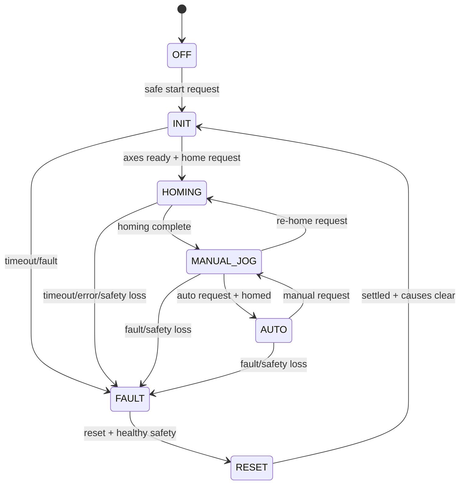

# Software Design Specification
## Industrial Motion and Safety Bench

**Revision:** 2.0 — As-built software design
**Date:** 2026-06-21
**Platform:** TwinCAT 3 / IEC 61131-3 Structured Text
**Safety status:** Safety-oriented demonstration; no certified SIL/PL claim

## 1. Purpose

This SDS defines the implemented module boundaries, cyclic data flow, state machines, public interfaces, simulation plant, test strategy and project-generation process. Reviewed source resides in `plc/`. Native TwinCAT objects are generated under `twincat/RuntimeSimulation/`.

## 2. Design principles

- One owner for each responsibility and state machine.
- Safety loss has priority over ordinary commands.
- HMI/TestHarness use the same validated command path.
- Physical I/O is exposed through unlocated `GVL_IO` symbols and linked to EtherCAT channels in TwinCAT; reusable source contains no fixed `%I/%Q` addresses.
- Simulation and hardware paths share status/command structures.
- Bounded arrays and ring buffers; no dynamic allocation.
- Generated TwinCAT IDs are deterministic and reviewable.
- Simulation acceptance never substitutes for hardware SAT.

## 3. Cyclic call order

| Order | Module | Inputs consumed | Outputs produced |
|---:|---|---|---|
| 1 | `FB_ConfigPackage` | reload request | validated machine configuration |
| 2 | `FB_SafetyManager` | virtual/physical I/O | safety status and permit |
| 3 | `FB_AlarmManager` | safety + prior-scan axis/homing status | alarm set and fault aggregate |
| 4 | `FB_ModeManager` | safety, faults, readiness, requests | mode and permits |
| 5 | `FB_CommandParser` | HMI/test command and permits | routed command pulses/levels |
| 6 | `FB_HomingManager` | mode, home request/switches | seek/set-position requests |
| 7 | `FB_AxisManager` | commands, safety, homing, config | axis status and motion result |
| 8 | `FB_TraceLogger` | state-change event | ring buffer and recent events |
| 9 | `FB_HMIModel` | public module outputs | HMI data projection |
| 10 | `FB_TestHarness` | public status, simulation trigger | commands and FAT results |

AlarmManager intentionally receives axis/homing status from the previous scan. This one-scan pipeline removes a cyclic dependency while preserving deterministic behavior.

## 4. Shared data model

### Enumerations

- `E_MachineMode`: OFF, INIT, HOMING, MANUAL_JOG, AUTO, FAULT, RESET.
- `E_AxisState`: DISABLED, STANDSTILL, HOMING, DISCRETE_MOTION, CONTINUOUS_MOTION, STOPPING, ERRORSTOP.
- `E_AlarmSeverity`: INFO, WARNING, FAULT, CRITICAL.
- `E_AlarmState`: INACTIVE, ACTIVE, ACKNOWLEDGED, CLEARED.
- `E_CommandType`: mode, jog, moves, stop, reset, home and alarm actions.
- `E_HomingState`, `E_TraceSource`, `E_TestPhase`, `E_TestResult`.

### Structures

| Structure | Purpose |
|---|---|
| `ST_AxisConfig` | limits, dynamics, homing and jog parameters |
| `ST_AxisStatus` | position, velocity, state, limits and errors |
| `ST_SafetyConfig/Status` | timing and consolidated safety condition |
| `ST_Alarm` | lifecycle, severity, source and timestamps |
| `ST_HMICommand` | operator/test command envelope |
| `ST_MotionCommand` | validated internal motion request |
| `ST_ModePermits` | explicit command permissions |
| `ST_MachineConfig` | complete active parameter package |
| `ST_TraceEvent` | bounded event record |
| `ST_TestResult` | scenario result/evidence text |
| `ST_HMIData` | read-only operator projection |
| `ST_VirtualIO` | software I/O image |

## 5. Module designs

### 5.1 Configuration

`FB_ConfigPackage` loads deterministic defaults on first scan or reload, validates axis count, positive dynamics, logical soft limits and non-zero timeouts, then exposes `bConfigValid`, `bSimulationMode` and a validation message.

### 5.2 SafetyManager

Inputs are selected from `GVL_VirtualIO` or `GVL_IO`. E-stop loss is applied immediately. Relay feedback discrepancy is timed. NC limit inputs are converted to active conditions. `bSafeToRun` requires healthy E-stop, relay feedback, guard door, STO, drive-ready aggregate, feedback, network, watchdog and no active limit.

The software permit is an additional control layer. Certified Phase 2 energy removal remains hardwired/safety-controlled.

### 5.3 AlarmManager

Implemented IDs:

| Slot/ID | Source | Severity |
|---|---|---|
| 1001 | E-stop active | Critical |
| 1002 | Relay discrepancy | Critical |
| 1003 | Limit active | Fault |
| 1004 | Guard door open | Critical |
| 1005 | STO active / drive inhibit | Critical |
| 1006 | EtherCAT/network unhealthy | Critical |
| 1007 | Watchdog timeout | Critical |
| 2001 | Drive, feedback or following error | Fault |
| 3001 | Homing error | Fault |
| 5001 | Configuration/command rejection | Warning |

Fault/critical alarms remain active until the source clears and acknowledgement/reset criteria are met. Outputs include active count, highest severity, fault aggregate, active array and bounded history.

### 5.4 ModeManager

Permits are derived from the current mode; other modules do not infer permissions independently.

### 5.5 CommandParser

Edge commands use `R_TRIG`; jog remains level-controlled while held. The parser validates axis index, mode permit and safety condition before routing. Rejections provide status, reason and counters. Internal state is never directly writable by the HMI.

### 5.6 HomingManager

Per-axis states are seek switch, back off, slow re-approach/index, set home position, complete or error. Axes are processed sequentially with step timeout and bounded retry count. Outputs are abstract seek directions and set-position pulses used by simulation or mapped motion logic.

### 5.7 AxisManager

Simulation mode integrates velocity at the configured 10 ms cycle and produces actual position, commanded position, following error, velocity and axis state. Final targets for absolute and relative moves are checked against soft limits. A continuous velocity command path is available for software-only validation. Safety loss cancels plant motion and removes enable.

Virtual drive-ready, drive-fault, encoder-health and following-error inputs latch axis error status until RESET, matching the intended drive recovery philosophy without requiring hardware.

Hardware mode contains PLCopen `MC_Power`, `MC_MoveAbsolute`, `MC_MoveRelative`, `MC_Stop` and `MC_Reset` instances for two `AXIS_REF` values. Axis references are linked only during NC/hardware commissioning.

### 5.8 TraceLogger

A 1,000-entry ring buffer stores bounded `ST_TraceEvent` records. The module exposes the newest 20 events, utilization and wrap state. Clear/export requests are rising-edge qualified.

### 5.9 HMIModel

The model copies public status into `ST_HMIData`, increments a cycle counter and supervises a 500 ms PLC heartbeat. Two seconds without a heartbeat change sets `bHMIDataStale`.

### 5.10 TestHarness

The harness is dormant when simulation mode is false. It executes sixteen FAT scenarios through the public command envelope and virtual I/O, records result/duration/expected/actual fields and exposes run/pass/fail counts.

## 6. Simulation plant

- Task period: 10 ms.
- Position unit: mm; velocity: mm/s.
- Position integration: `position += velocity x 0.01`.
- Default limits: −10 to +300 mm.
- Maximum velocity: 500 mm/s.
- E-stop, guard, STO, limit, network and watchdog loss sets velocity to zero and disables motion.
- Drive fault, encoder feedback loss and following-error injection latch axis error until RESET.
- Scope aliases: `MAIN.fActualPosition`, `MAIN.fActualVelocity`.

## 7. HMI command handshake

1. Check data is not stale and the required permit is true.
2. Populate command fields with `bExecute = FALSE`.
3. Pulse `bExecute = TRUE` for edge commands, then return false.
4. Maintain execute only for hold-to-run jog.
5. Display parser status and rejection reason.

## 8. Project generation

`tools/generate_twincat_project.ps1` converts reviewed ST into native objects:

- 26 `.TcDUT` objects.
- 3 `.TcGVL` objects.
- 10 function blocks plus `MAIN.TcPOU`.
- One 10 ms `PlcTask.TcTTO`.
- A portable `.plcproj` with required libraries.

GUIDs are derived from stable object names so regeneration does not create random diffs.

## 9. Error handling

- Invalid configuration inhibits acceptance and raises 5001.
- Invalid commands are rejected before motion blocks see them.
- Homing timeout enters error/FAULT.
- Axis errors aggregate to 2001/FAULT.
- Safety loss has same-scan motion priority.
- Test timeout records `TRES_TIMEOUT` and advances only through teardown.

## 10. Quality gates

- [x] Module responsibilities and cyclic order defined.
- [x] Seven-mode transitions and permits implemented.
- [x] Safety, alarms, homing, command and plant logic implemented.
- [x] No implementation placeholder comments in PLC source.
- [x] Native TwinCAT objects generated deterministically.
- [x] Runtime baseline produced 12/12 and retained Scope evidence.
- [x] HMI prototype expanded to the 16-scenario software FAT list.
- [x] Modular native project compile confirmation under XAE build 4024.75.
- [x] Modular native project download and online execution confirmation.
- [x] Repeat FAT using modular native application: Run 02, 16/16 passed.
- [ ] Hardware SAT (Phase 2 only).

## 11. Known limitations

- Simulation plant dynamics are intentionally simple and do not model torque, inertia or closed-loop servo response; following error is a deterministic injected diagnostic.
- Run 01 belongs to the deterministic runtime baseline established during platform recovery.
- Hardware mapping, tuning and certified safety remain Phase 2 activities.
- Alarm and trace timestamp fields require target-time integration during production deployment.

## 12. Traceability

URS/FDS requirements map to FAT in `docs/09_FAT_protocol.md`, cause/effect in `docs/07_cause_effect_matrix.md`, operator tags in `hmi/hmi_tag_map.md`, and hardware validation in `docs/10_SAT_protocol.md`.
