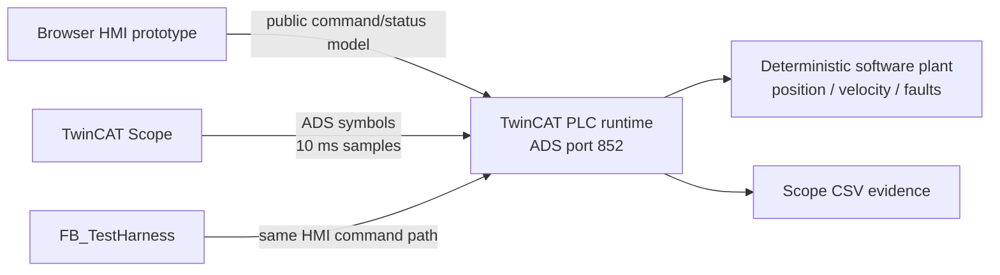
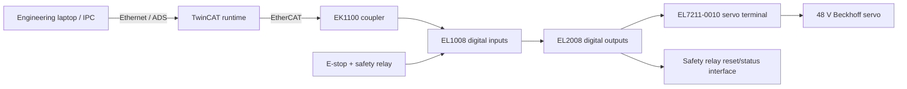

# Network and Control Architecture

**Revision:** 1.0 — 2026-06-21
**Status:** Software baseline; Phase 2 devices provisional

## Phase 1 — software simulation

| Endpoint | Interface | Purpose |
|---|---|---|
| TwinCAT XAE | Local engineering connection | Build, download, online diagnostics |
| PLC runtime | ADS port 852 | Executing simulation application |
| Scope | ADS symbol acquisition | `MAIN.fActualPosition`, `MAIN.fActualVelocity` |
| HMI prototype | Local HTTP/static files | Operator experience and FAT demonstration |

No external network route is required for Phase 1. Machine-specific AMS route files are deliberately excluded from source control.

## Phase 2 — EtherCAT bench

## Addressing and boundaries

- ADS Net ID is installation-specific and must not be hard-coded in portable source.
- PLC port defaults to 852 for this project instance.
- EtherCAT slave addresses are assigned during commissioning and recorded in the logbook.
- Safety-related hardwired energy removal remains outside standard PLC software.
- The standard PLC monitors safety status and commands controlled stops; it does not replace certified safety hardware.

## Security

- Keep the runtime on a trusted engineering network.
- Do not expose ADS ports directly to untrusted networks.
- Use Windows firewall rules and least-privilege engineering accounts.
- Archive configuration and route changes with the commissioning record, not in public Git history.
